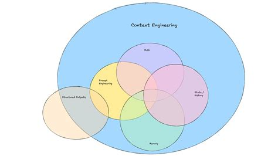
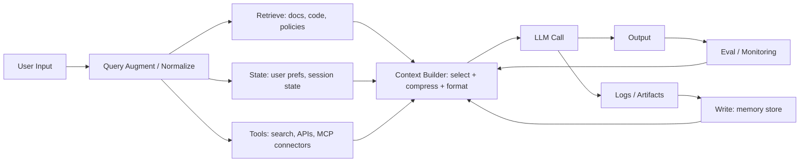
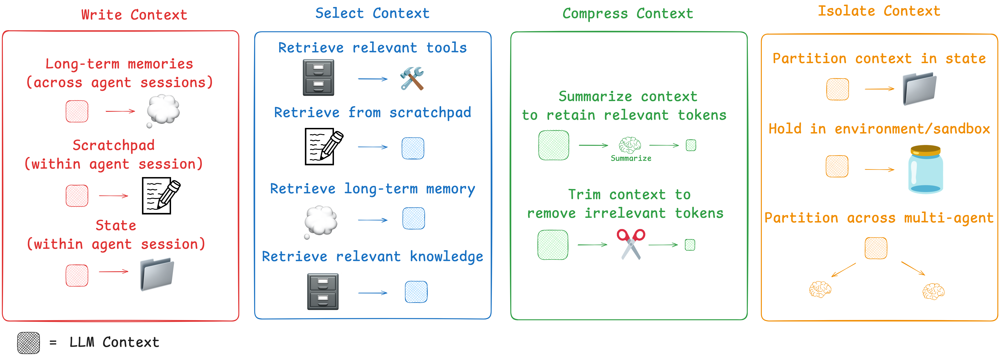

> 작성 목적: 최근 “Context Engineering”이라는 주제로 탐색하며 얻은 몇 가지 레퍼런스를 토대로 정리해 보았습니다.
>
> Co-authored with LLM (ChatGPT, gpt-5.2-thinking)

**많은 실무 상황에서 에이전트 성능의 병목은 모델 자체보다, 매 턴 컨텍스트를 어떻게 구성·유지·정리하느냐에서 더 자주 나타납니다.**

<!--more-->

---

## 벤다이어그램(참고 이미지)

> image from https://www.promptingguide.ai/guides/context-engineering-guide
>
> 위 이미지는 “프롬프트/컨텍스트” 관점 차이를 시각화하는 데 도움될 수 있는 예시입니다.  

---

## 1) 먼저 “컨텍스트”가 뭐냐: LLM에게 보이는 **토큰들의 집합**

Anthropic은 컨텍스트를 “LLM이 응답을 샘플링할 때 함께 들어가는 토큰들의 집합”으로 설명합니다. 즉, 컨텍스트는 단순히 ‘사용자 질문’만이 아니라 **시스템 프롬프트, 대화 히스토리, 도구 호출 결과, 외부 데이터** 등 “모델이 이번 턴에 참고할 수 있는 것 전체”에 가깝습니다.  
(출처: https://www.anthropic.com/engineering/effective-context-engineering-for-ai-agents)

여기서 중요한 뉘앙스가 하나 더 붙습니다:

- 컨텍스트는 **중요하지만 유한한 자원**이고,
- 토큰이 많아질수록 항상 좋아지기보다는 “주의/집중 예산(attention budget)”을 소모해 **회상 성능이 떨어지는 현상**(일부는 *context rot* 같은 이름으로 부르기도 함)이 관측될 수 있다는 이야기입니다. 다만 이 경향은 모델/과업/정보 배치에 따라 달라질 수 있고, attention budget은 엄밀 공식이라기보다 실무적 메타포에 가깝습니다.  
(출처: https://www.anthropic.com/engineering/effective-context-engineering-for-ai-agents)

개발자 관점에서 비유하면, 모델 호출은 “함수 호출”인데, 컨텍스트는 그 함수에 넘기는 **인자 + 전역 상태 + 로그 + 외부 조회 결과**를 한 번에 문자열로 밀어 넣는 느낌입니다. 그래서 “무엇을 넣을지/빼야 할지”가 곧 설계 이슈가 됩니다.

### 용어 정의(포맷 통일)

- **Context(컨텍스트)**: LLM이 이번 턴 응답 생성에 참고하는 입력 토큰 전체
- **Attention Budget(주의/집중 예산)**: 모델이 입력 전반에 주의를 배분하는 한계를 설명하는 실무적 메타포
- **Context Rot(컨텍스트 로트)**: 컨텍스트가 길어지며 핵심 정보 회수가 어려워지는 경향을 가리키는 비공식 표현
- **Write(저장)**: 윈도우 밖 저장소에 나중에 재사용할 맥락을 기록하는 전략
- **Select(선택)**: 이번 턴에 필요한 정보만 골라 컨텍스트 윈도우로 로딩하는 전략
- **Compress(압축)**: 정보를 요약/정규화해 토큰 사용량을 줄이는 전략
- **Isolate(격리)**: 목적·권한·신뢰도가 다른 정보를 분리해 혼선을 줄이는 전략

---

## 2) Prompt Engineering vs Context Engineering: 경계가 흐릿하지만, 관점은 다르다

레퍼런스들은 대체로 이런 방향으로 구분합니다(단, 완전히 같은 말을 하진 않습니다).

- **Prompt Engineering**: “프롬프트(특히 시스템 프롬프트)를 어떻게 쓰고 조직할까”
- **Context Engineering**: “프롬프트 바깥에서 들어오는 것까지 포함해서, 매 턴 컨텍스트 윈도우를 무엇으로 채울까(그리고 어떻게 유지/정리할까)”

Anthropic은 컨텍스트 엔지니어링을 프롬프트 엔지니어링의 “자연스러운 다음 단계”로 보면서도, 초점이 **‘프롬프트 텍스트’에서 ‘컨텍스트 상태 전체’**로 이동했다고 말합니다.  
(출처: https://www.anthropic.com/engineering/effective-context-engineering-for-ai-agents)

실무에서는 이 용어를 아래처럼 **이원화**해두면 오해를 줄이기 좋습니다.

- **좁은 의미의 Context Engineering**: 매 턴 입력 윈도우를 어떻게 구성할지(선택/압축/포맷) 최적화
- **넓은 의미의 Context Engineering**: 입력 생성 파이프라인 전체(검색/도구/메모리/평가 루프) 운영 최적화

> image from https://www.anthropic.com/engineering/effective-context-engineering-for-ai-agents

PromptingGuide도 “단순 프롬프트를 넘어 ‘전체 컨텍스트를 설계(architect)’하는 단계”로 정의합니다.  
(출처: https://www.promptingguide.ai/guides/context-engineering-guide)

---

## 3) 서로 다른 해석(프레이밍) 비교표

아래 표는 “정답”이라기보다, 같은 말을 **어떤 문제의식으로 재단**하느냐의 차이를 보여줍니다.

| 출처 | Context Engineering을 바라보는 중심 질문 | 강조점(무게중심) | 키워드/도구 감각 |
|---|---|---|---|
| Anthropic | “원하는 에이전트 행동을 만들 가능성이 높은 **컨텍스트 구성**은?” | 매 턴 토큰을 **큐레이션/유지**(finite resource, attention budget) | 에이전트 루프, 컨텍스트 관리, MCP 포함한 외부정보/도구 |
| Lance Martin | “에이전트 컨텍스트 문제를 **실무 패턴**으로 묶으면?” | 4버킷: **Write / Select / Compress / Isolate** | 상태 저장, 선택적 로딩, 요약/압축, 분리(멀티에이전트/스키마) |
| PromptingGuide | “개발자가 ‘전체 컨텍스트’를 **설계하고 반복 개선**하는 프로세스는?” | 아키텍처 + 프로세스(평가/반복) | RAG, 툴 정의, 포맷, 메모리, 프롬프트 체인, eval pipeline |
| (추가) LangChain Docs | “에이전트가 실패하는 이유는 종종 **모델이 아니라 컨텍스트**” | “올바른 정보/도구를 올바른 포맷으로” | 에이전트 루프 제어, 컨텍스트 타입 분류/전달 |

- Anthropic: https://www.anthropic.com/engineering/effective-context-engineering-for-ai-agents  
- Lance Martin: https://rlancemartin.github.io/2025/06/23/context_engineering/  
- PromptingGuide: https://www.promptingguide.ai/guides/context-engineering-guide  
- LangChain Docs(참고): https://docs.langchain.com/oss/python/langchain/context-engineering  

이 표에서 재미있는 포인트는:

- Anthropic은 “토큰 최적화”라는 **물리(제약) 중심** 관점이 강하고,
- Lance는 “실무에서 바로 쓰는 **패턴 카탈로그**” 느낌이 강하며,
- PromptingGuide는 “설계 + 평가 + 반복”을 포함한 **엔지니어링 프로세스**에 더 무게가 있습니다.

---

## 4) 왜 실패하는가: “더 넣기”가 답이 아닐 때가 많다

컨텍스트가 커질수록 생길 수 있는 문제를 “이름 붙여” 설명하는 글들도 있습니다. 예컨대 Weaviate 글은 컨텍스트가 커질 때의 실패 모드를 **poisoning / distraction / confusion / clash**처럼 분류해 소개합니다.  
(출처: https://weaviate.io/blog/context-engineering)

이런 분류가 유용한 이유는, 팀이 디버깅할 때 원인을 동일한 포맷으로 빠르게 공유할 수 있기 때문입니다:

- **Poisoning(오염)**: 신뢰도 낮은 정보가 섞여 답변 품질을 훼손하는 상태
- **Distraction(주의 분산)**: 관련성 낮은 맥락이 많아 핵심 정보에 주의가 분산되는 상태
- **Confusion(혼란)**: 서로 다른 설명/지시가 혼재되어 모델의 판단 기준이 불명확한 상태
- **Clash(충돌)**: 상충하는 사실/규칙이 동시에 주입되어 출력 일관성이 깨지는 상태

완전한 표준 용어는 아니지만, 문제를 빠르게 공유하는 데는 도움이 될 수 있어 보입니다.

**앞의 실패 모드는 공통적으로 ‘정보가 흘러들어오는 경로를 통제하지 못할 때’ 발생하므로, 다음은 이를 시스템 레벨에서 다루는 컨텍스트 파이프라인 관점으로 전환합니다.**

---

## 5) 컨텍스트 파이프라인으로 설계한다

PromptingGuide는 컨텍스트 엔지니어링을 “반복적으로 최적화하는 개발 프로세스”로 봅니다(평가 파이프라인 포함).  
(출처: https://www.promptingguide.ai/guides/context-engineering-guide)

즉, 프롬프트 한 번 잘 써서 끝내기보다는, **컨텍스트가 만들어지는 경로**를 설계하고 계속 조정합니다.

Mermaid로 그리면 대략 이런 흐름이 됩니다:

여기서 “Context Engineering”은 **C(Context Builder)** 박스 하나로만 한정되기보다, R/S/T/MEM/E 전체를 포함한 “컨텍스트 흐름 설계”로 확장해 볼 수 있습니다.

**이 파이프라인을 팀에서 실제 작업 단위로 나누려면, 다음의 4버킷(Write/Select/Compress/Isolate)으로 쪼개 보는 방법이 유용합니다.**

---

## 6) Lance의 Context Engineering for Agents 4가지 버킷 (Write / Select / Compress / Isolate)

Lance Martin은 에이전트 컨텍스트 접근을 4가지로 묶습니다.  
(출처: https://rlancemartin.github.io/2025/06/23/context_engineering/)

이 프레임은 팀 내에서 공통언어로 쓰기 좋아 보입니다.

> image from https://rlancemartin.github.io/2025/06/23/context_engineering/

### 6.1 Write(저장): 컨텍스트를 “쓴다”

- 의미: 지금 당장 다 넣지 말고, **나중에 꺼내쓸 수 있게** 외부에 저장
- 예: 작업 로그/중간결론을 파일/DB에 저장, 장기 메모리 구축
- 포인트: “모든 걸 대화 히스토리에 누적”하지 않게 해줍니다.

### 6.2 Select(선택): 필요한 것만 가져온다

- 의미: 외부에 있는 정보 중 이번 턴에 도움이 될 것만 **컨텍스트 윈도우로 로딩**
- 예: RAG로 관련 문서 top-k, 사용자 설정/상태, 최근 툴 결과 중 핵심만

### 6.3 Compress(압축): 토큰을 압축한다

- 의미: 긴 문서/히스토리를 요약하거나, 스키마화해서 **필요 토큰만 남기기**
- 예: 대화 요약(rolling summary), 툴 결과 정규화(JSON), 긴 로그를 핵심만 남김

### 6.4 Isolate(격리): 컨텍스트를 분리한다

- 의미: 서로 다른 목적/권한/역할의 정보를 한 덩어리로 섞지 않고 **분리**
- 예: 멀티 에이전트로 역할 분리, 스키마 필드 분리(LLM에 노출되는 필드/비노출 필드)

**정리하면 4버킷은 “어떻게 운영할지”를 팀 액션으로 쪼개는 도구이고, 8장에서는 이 흐름에서 MCP가 맡는 역할(연결 계층)을 분리해 보겠습니다.**

---

## 7) MCP(Model Context Protocol)는 어디에 놓일까?

Anthropic 글은 컨텍스트에 “MCP 같은 외부 연결, 도구, 데이터”가 포함될 수 있음을 직접 언급합니다.  
(출처: https://www.anthropic.com/engineering/effective-context-engineering-for-ai-agents)

그래서 MCP는 (단정하긴 어렵지만) 많은 팀에서 대략 이렇게 해석할 수 있습니다:

- MCP 자체가 “컨텍스트 엔지니어링”이라기보다는,
- **컨텍스트를 가져오는 ‘관문/커넥터’**를 표준화해주는 도구/프로토콜에 가깝고,
- 그 위에서 “무엇을 언제 얼마나 가져와 컨텍스트 윈도우에 넣을지”를 설계하는 게 컨텍스트 엔지니어링의 영역.

---

## 8) 개발자 친화적 예시: “PR 리뷰 에이전트”에 적용해보면

예를 들어 PR 리뷰를 돕는 에이전트를 만든다고 가정해봅시다(정답 동작은 팀/조직마다 달라서, 아래는 한 가지 예시입니다).

### 컨텍스트 소스(Write/Select)

- Write(저장): 팀 코딩 규약, 과거 리뷰 코멘트 패턴, 프로젝트 모듈 구조 요약
- Select(선택): 이번 PR의 diff, 관련 이슈 링크, 변경된 모듈의 핵심 도메인 규칙 문서

### Compress(압축)

- diff가 길면 “변경의 요지(파일별 핵심 변경)”만 추린 요약 + 중요한 코드 블록 원문 일부
- 이슈/티켓도 “AC(acceptance criteria) / 리스크”만 구조화

### Isolate(격리)

- “보안/개인정보 규칙”은 별도 필드로 두고, 필요할 때만 LLM에 노출
- 리뷰어 역할(스타일/아키텍처/성능)을 분리한 멀티 에이전트로 운영(가능하다면)

### 간단한 A/B 실험으로 효과 검증하기

- **A안(베이스라인)**: PR diff 원문 + 짧은 시스템 프롬프트만 제공
- **B안(컨텍스트 엔지니어링 적용)**: Write/Select/Compress/Isolate를 적용한 구조화 컨텍스트 제공
- 동일 PR 샘플셋에서 두 방식을 비교해, 품질 향상을 “느낌”이 아니라 지표로 확인할 수 있을 것으로 보입니다.

| 지표 | 정의(예시) | 목표 방향 |
|---|---|---|
| 정확도(정탐률) | 실제 이슈를 맞게 지적한 비율 | 높을수록 좋음 |
| 근거 일치율 | 코멘트가 실제 코드/규칙 근거와 일치한 비율 | 높을수록 좋음 |
| FP율(False Positive) | 문제 아닌데 문제라고 지적한 비율 | 낮을수록 좋음 |
| Latency | PR 1건당 평균 응답 시간 | 낮을수록 좋음 |
| Token Cost | PR 1건당 평균 토큰 사용량 | 낮을수록 좋음 |

이렇게 하면 “그냥 diff를 통째로 넣고 리뷰해줘”에서 벗어나, **리뷰 품질에 필요한 맥락을 설계하고 검증**하는 쪽으로 접근이 바뀝니다.

---

## 9) 체크리스트: 팀에서 바로 써먹기 좋은 질문들

컨텍스트 엔지니어링을 “철학”이 아니라 “디버깅 가능한 설계”로 만들려면, 이런 질문이 꽤 유용해 보입니다.

- **(선택)** 지금 컨텍스트에 들어간 정보 중, “이번 턴 의사결정”에 정말 필요했던 것은?
- **(압축)** 길이 때문에 요약했다면, 어떤 정보가 사라져도 괜찮다고 판단했나?
- **(격리)** 서로 다른 신뢰도/권한/역할의 정보가 섞여서 문제를 만들고 있진 않나?
- **(저장)** 다음 턴/다음 세션에 재사용해야 할 지식은 어디에 저장되고 어떻게 다시 선택되나?
- **(평가)** 컨텍스트 변경이 성능에 영향을 줬는지, 확인할 수 있는 간단한 평가가 있나?

---

## 10) 마무리: 더 많이 넣기보다, 더 맞게 설계하기

이 글에서 정리한 포인트를 한 줄로 요약하면, **컨텍스트 엔지니어링은 “모델을 바꾸는 일”보다 “입력을 운영하는 일”에 가깝다**는 점입니다.  
실무에서는 보통 `왜 실패하는가(실패 모드)`를 먼저 확인하고, `어떻게 다룰까(파이프라인·4버킷)`를 설계한 뒤, `MCP 같은 연결 계층의 역할`을 분리해 생각할 때 시행착오가 줄어듭니다.

결국 핵심은 “더 많은 토큰”이 아니라, **이번 턴에 필요한 맥락을 선택·압축·격리해 적절한 형태로 주입하고, 결과를 다시 측정해 개선하는 루프**를 만드는 것입니다.

---

## References (원문)

- Anthropic: “Effective context engineering for AI agents”  
  https://www.anthropic.com/engineering/effective-context-engineering-for-ai-agents
- Lance Martin: “Context Engineering for Agents”  
  https://rlancemartin.github.io/2025/06/23/context_engineering/
- PromptingGuide: “Context Engineering Guide”  
  https://www.promptingguide.ai/guides/context-engineering-guide
- (추가로 함께 보면 좋은) LangChain Docs: Context engineering in agents  
  https://docs.langchain.com/oss/python/langchain/context-engineering
- (추가로 함께 보면 좋은) Weaviate: Context Engineering (failure modes/설명 방식이 실무적)  
  https://weaviate.io/blog/context-engineering
