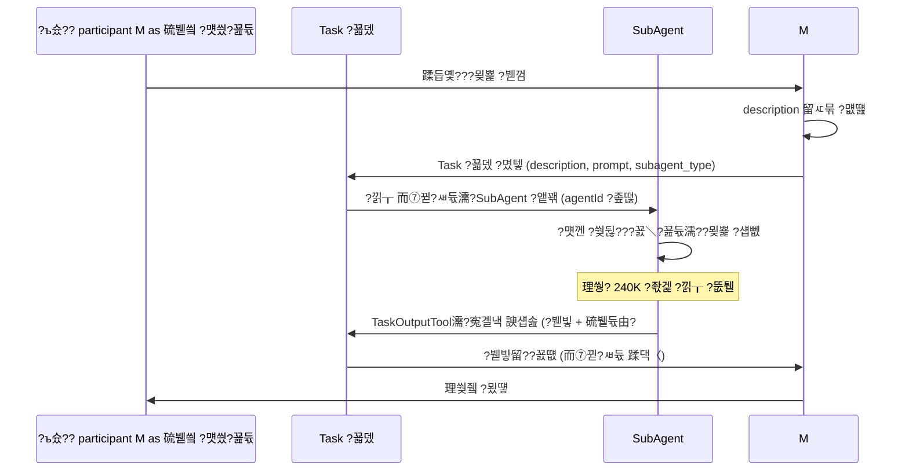
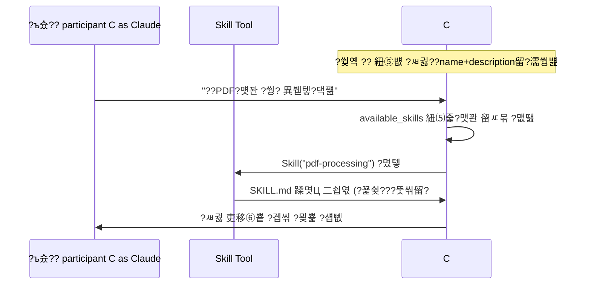
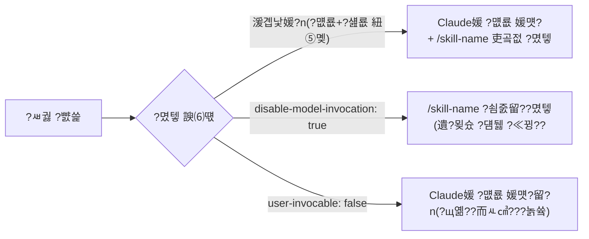
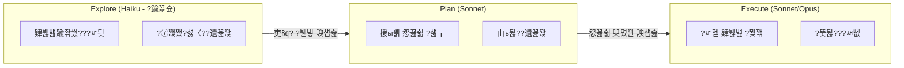

---
layout: post
title: "Claude Code SubAgent 뜯어보기"
date: 2026-02-21 21:34:00 +0900
categories: [AI, ClaudeCode]
tags: [claude-code, subagent, agent-architecture, context-engineering, skills]
description: "Claude Code SubAgent의 개념, 내부 동작, 구성 방식, 실전 패턴과 한계를 아키텍처 관점에서 깊이 있게 정리한 글"
---

<!--more-->
# Claude Code SubAgent ??뼱蹂닿린

Claude Code??SubAgent??**?낅┰??而⑦뀓?ㅽ듃 ?덈룄?곗뿉???뱀젙 ?묒뾽???섑뻾?섎뒗 ?뱁솕??AI ?댁떆?ㅽ꽩??*?? 硫붿씤 ?먯씠?꾪듃??而⑦뀓?ㅽ듃瑜?蹂댁〈?섎㈃??蹂듭옟???묒뾽??遺꾪븷쨌?꾩엫?섎뒗 ?듭떖 硫붿빱?덉쬁?쇰줈, 2025??以묐컲 ?꾩엯 ?댄썑 Claude Code ?꾪궎?띿쿂??以묒떖異뺤씠 ?섏뿀?? ?댁옣 SubAgent 3醫?Explore, Plan, General-purpose)怨??ъ슜???뺤쓽 SubAgent瑜?吏€?먰븯硫? 理쒕? **10媛쒖쓽 ?숈떆 蹂묐젹 ?ㅽ뻾**, YAML frontmatter 湲곕컲??留덊겕?ㅼ슫 ?뚯씪 援ъ꽦, MCP ?꾧뎄 ?곸냽???뱀쭠?쇰줈 ?쒕떎. Simon Willison(?€紐?媛쒕컻?????쒗쁽泥섎읆 SubAgent??蹂몄쭏?곸쑝濡?**"?좏겙 而⑦뀓?ㅽ듃 理쒖쟻???댄궧"** ?대ʼn, 理쒕? ~240,000 ?좏겙???낅┰?곸쑝濡??뚮퉬????吏㏃? ?붿빟留?遺€紐⑥뿉寃?諛섑솚?쒕떎.

---

## SubAgent??湲곕낯 媛쒕뀗怨??먯퐫?쒖뒪??????븷

SubAgent???뱀젙 ?좏삎???묒뾽??泥섎━?섎룄濡??ㅺ퀎???낅┰ AI ?몄뒪?댁뒪?? 媛?SubAgent???먯껜 而⑦뀓?ㅽ듃 ?덈룄?곗뿉???ㅽ뻾?섎ʼn, 而ㅼ뒪?€ ?쒖뒪???꾨＼?꾪듃쨌?뱀젙 ?꾧뎄 ?≪꽭?ㅒ룸룆由쎌쟻 沅뚰븳??媛뽯뒗?? Claude媛€ SubAgent??description怨??쇱튂?섎뒗 ?묒뾽??留뚮굹硫??먮룞?쇰줈 ?꾩엫?섍퀬, SubAgent???낅┰?곸쑝濡??묒뾽????寃곌낵 ?붿빟??諛섑솚?쒕떎.

Claude Code??**3醫낆쓽 ?댁옣 SubAgent**瑜??쒓났?쒕떎.

| SubAgent | 紐⑤뜽 | 沅뚰븳 | ?덉슜 ?꾧뎄 | ??븷 |
|----------|------|------|-----------|------|
| **Explore** | Haiku | ?쎄린 ?꾩슜 | Glob, Grep, Read, ?쒗븳??Bash | 肄붾뱶踰좎씠??鍮좊Ⅸ ?먯깋 (quick / medium / very thorough 3?④퀎) |
| **Plan** | Sonnet | ?쎄린 ?꾩슜 | Glob, Grep, Read | Plan Mode?먯꽌留??몄텧, 援ы쁽 怨꾪쉷 ?섎┰ |
| **General-purpose** | Sonnet | ?꾩껜 | ?꾩껜 ?꾧뎄??| ?먯깋怨??섏젙??紐⑤몢 ?붽뎄?섎뒗 蹂듭옟???ㅻ떒怨??묒뾽 |

SubAgent媛€ Claude Code ?먯퐫?쒖뒪?쒖뿉???섑뻾?섎뒗 ?듭떖 ??븷?€ ??媛€吏€??

- **而⑦뀓?ㅽ듃 蹂댁〈** ???섏떗 媛??뚯씪???쎄굅??愿묐쾾?꾪븳 寃€?됱쓣 ?섑뻾?대룄 硫붿씤 ?€?붾뒗 ?붿빟留?諛쏆쑝誘€濡? ?μ떆媛??몄뀡?먯꽌 而⑦뀓?ㅽ듃 ?뚯쭊??諛⑹??쒕떎.
- **?쒖빟 議곌굔 ?곸슜** ??媛?SubAgent???덉슜?섎뒗 ?꾧뎄瑜??쒗븳???덉쟾???묒뾽 踰붿쐞瑜?媛뺤젣?쒕떎.
- **援ъ꽦 ?ъ궗??* ???ъ슜???섏? SubAgent(`~/.claude/agents/`)瑜??뺤쓽?섎㈃ 紐⑤뱺 ?꾨줈?앺듃?먯꽌 ?숈씪???꾨Ц ?먯씠?꾪듃瑜??ъ궗?⑺븷 ???덈떎.

怨듭떇 臾몄꽌??SubAgent?€ Agent Team??李⑥씠??紐낇솗??援щ텇?쒕떎.

| 援щ텇 | SubAgent | Agent Team |
|------|----------|------------|
| **?ㅽ뻾 踰붿쐞** | ?⑥씪 ?몄뀡 ??| 蹂꾨룄 ?몄뀡 媛?|
| **寃곌낵 蹂닿퀬** | 硫붿씤 而⑦뀓?ㅽ듃???붿빟 諛섑솚 | ?몄뀡 媛??곹샇 ?듭떊 |
| **?깆닕??* | ?덉젙 | ?ㅽ뿕??|

---

## ?대? ?숈옉 ?먮━: orchestrator-subagent ?⑦꽩

Claude Code??**?⑥씪 ?ㅻ젅??留덉뒪??猷⑦봽**(?대? 肄붾뱶紐?"nO")瑜??ъ슜?쒕떎. 紐⑤뜽 ?묐떟???꾧뎄 ?몄텧???ы븿?섎㈃ 猷⑦봽媛€ 怨꾩냽 ?ㅽ뻾?섍퀬, ?쇰컲 ?띿뒪?몃쭔 諛섑솚?섎㈃ 猷⑦봽媛€ 醫낅즺?섏뼱 ?ъ슜?먯뿉寃??쒖뼱沅뚯씠 ?뚯븘媛꾨떎. ???ㅺ퀎??蹂듭옟??硫€?곗뿉?댁쟾???ㅼ썫 ?€??**?붾쾭源??⑹씠?굿룻닾紐낆꽦쨌?좊ː??*???곗꽑?쒗븳??

**Task ?꾧뎄**媛€ SubAgent ?앹꽦???좎씪???명꽣?섏씠?ㅻ떎.

| ?꾨뱶 | ?꾩닔 | ?ㅻ챸 |
|------|------|------|
| `description` | ??| 3-5?⑥뼱 ?붿빟 |
| `prompt` | ??| ?꾩껜 ?묒뾽 吏€???댁슜 |
| `subagent_type` | ??| ?먯씠?꾪듃 ?좏삎 |
| `resume` | ??| ?댁쟾 ?먯씠?꾪듃 ID (?ш컻 ?? |

?ㅼ젣 ?몄텧 ??硫붿씤 ?먯씠?꾪듃媛€ Task ?꾧뎄瑜??듯빐 SubAgent瑜??앹꽦?섎㈃, SubAgent???먯껜 ?쒖뒪???꾨＼?꾪듃?€ 湲곕낯 ?섍꼍 ?뺣낫(?묒뾽 ?붾젆?좊━)留?諛쏄퀬 **硫붿씤 Claude Code???꾩껜 ?쒖뒪???꾨＼?꾪듃???꾨떖?섏? ?딅뒗??** ?묒뾽 ?꾨즺 ??**TaskOutputTool**???듯빐 ?좏겙 ?샕룸룄援??ъ슜 ?잛닔쨌?뚯슂 ?쒓컙 硫뷀듃由?낵 ?④퍡 寃곌낵瑜?諛섑솚?쒕떎.

而⑦뀓?ㅽ듃 ?꾨떖?€ ?섎룄?곸쑝濡?**?⑤갑?Β룰꺽由ы삎**?쇰줈 ?ㅺ퀎?먮떎. 硫붿씤 ?먯씠?꾪듃??Task ?꾧뎄??`prompt` ?꾨뱶瑜??듯빐?쒕쭔 SubAgent??而⑦뀓?ㅽ듃瑜??꾨떖?섍퀬, SubAgent???꾨즺 ???붿빟留?諛섑솚?쒕떎. SubAgent媛€ ?먯깋 以?諛쒓껄??以묎컙 肄섑뀗痢좊뒗 硫붿씤 ?€?붿쓽 而⑦뀓?ㅽ듃瑜??ㅼ뿼?쒗궎吏€ ?딅뒗??



媛?SubAgent ?ㅽ뻾?먮뒗 怨좎쑀??`agentId`媛€ ?좊떦?섎ʼn, ?€??湲곕줉?€ 蹂꾨룄 ?몃옖?ㅽ겕由쏀듃 ?뚯씪(`agent-{agentId}.jsonl`)???€?λ맂?? `resume` ?뚮씪誘명꽣濡??댁쟾 ?€?붾? ?댁뼱媛????덉뼱 **?ш컻 媛€?ν븳(resumable) ?먯씠?꾪듃** ?⑦꽩??吏€?먰븳??

> ?좑툘 **?듭떖 ?꾪궎?띿쿂 ?쒖빟**: SubAgent???ㅻⅨ SubAgent瑜??앹꽦?????녿떎. ?ш???利앹떇??諛⑹??섎뒗 ?섎룄???ㅺ퀎濡? ?꾩엫 源딆씠???뺥솗??1?④퀎濡??쒗븳?쒕떎. ?곗뇙??SubAgent ?ㅽ뻾???꾩슂?섎㈃ 硫붿씤 ?€?붿뿉???쒖감?곸쑝濡??몄텧?댁빞 ?쒕떎.

---

## ?붿??덉뼱留??꾪궎?띿쿂 ?ъ링 遺꾩꽍

### 而⑦뀓?ㅽ듃 愿€由ъ? ?먮룞 ?뺤텞

媛?SubAgent??**?꾩쟾???낅┰??而⑦뀓?ㅽ듃 ?덈룄??*瑜?媛€吏€硫? ?먯껜?곸쑝濡?**98% ?ъ슜瑜좎뿉???먮룞 ?뺤텞**(auto-compaction)???몃━嫄곕맂?? 硫붿씤 ?€?붽? ?뺤텞?섏뼱??SubAgent ?몃옖?ㅽ겕由쏀듃?먮뒗 ?곹뼢???녿떎. ?몃옖?ㅽ겕由쏀듃???몄뀡 ?댁뿉??吏€?띾릺硫? 湲곕낯 30?????먮룞 ?뺣━?쒕떎(`cleanupPeriodDays`濡??ㅼ젙 媛€??. ??寃⑸━ ?뺣텇??SubAgent???섏떗 媛쒖쓽 ?뚯씪怨?臾몄꽌瑜??먯깋?섎㈃?쒕룄 硫붿씤 ?€?붾? 源⑤걮?섍쾶 ?좎??????덈떎.

MCP ?꾧뎄 寃€?됱뿉?쒕룄 理쒖쟻?붽? ?곸슜?쒕떎. v2.1.7遺€??MCP ?꾧뎄 ?ㅻ챸??而⑦뀓?ㅽ듃 ?덈룄?곗쓽 10%瑜?珥덇낵??寃쎌슦, Claude Code???먮룞?쇰줈 ToolSearch瑜??듯븳 ?⑤뵒留⑤뱶 ?붿뒪而ㅻ쾭由щ줈 ?꾪솚?쒕떎. ??理쒖쟻?붾줈 **?꾩껜 ?먯씠?꾪듃 ?좏겙 ?ъ슜?됱씠 ~46.9% 媛먯냼**?덈떎.

### 蹂묐젹 ?ㅽ뻾怨??쒗븳?ы빆

Claude Code??理쒕? **10媛쒖쓽 ?숈떆 SubAgent ?쒖뒪??*瑜?吏€?먰븯硫? 珥덇낵 ?붿껌?€ 吏€?μ쟻 ?먯엵?쇰줈 泥섎━?쒕떎. SubAgent??湲곕낯?곸쑝濡?諛깃렇?쇱슫?쒖뿉???ㅽ뻾?섎ʼn, 硫붿씤 ?먯씠?꾪듃??SubAgent ?ㅽ뻾 以묒뿉???ъ슜???낅젰??諛쏆쓣 ???덈떎. `Ctrl+B`濡??ㅽ뻾 以묒씤 ?쒖뒪?щ? ?섎룞?쇰줈 諛깃렇?쇱슫???꾪솚?????덇퀬, `/tasks` ?ㅼ씠?쇰줈洹몄뿉??紐⑤뱺 ?쒖꽦 諛깃렇?쇱슫???쒖뒪?ъ쓽 ?ㅼ떆媛??곹깭瑜??뺤씤?????덈떎.

?ㅻ쭔 諛깃렇?쇱슫??SubAgent?먮뒗 以묒슂???쒗븳???덈떎.

| ??ぉ | 諛깃렇?쇱슫??SubAgent |
|------|---------------------|
| MCP ?꾧뎄 ?ъ슜 | ??遺덇? |
| 誘몄듅??沅뚰븳 ?붿껌 | ???먮룞 嫄곕? |
| `AskUserQuestion` ?몄텧 | ???ㅽ뙣 (?먯씠?꾪듃??怨꾩냽 吏꾪뻾) |
| ?닿껐梨?| ?ш렇?쇱슫?쒖뿉???ш컻 |
| ?꾩쟾 鍮꾪솢?깊솕 | `CLAUDE_CODE_DISABLE_BACKGROUND_TASKS=1` |

### ?곹깭 愿€由ъ? Hook ?쒖뒪??
v2.1.16?먯꽌 ?꾩엯??**Tasks ?쒖뒪??*?€ DAG(諛⑺뼢??鍮꾩닚??洹몃옒?? 湲곕컲 ?섏〈??異붿쟻??吏€?먰븳?? `blocks`/`blockedBy` 愿€怨꾨줈 ?쒖뒪??媛??좏썑 愿€怨꾨? ?뺤쓽?????덉쑝硫? ?곹깭??`~/.claude/tasks/` ?붾젆?좊━???€?λ맂?? ?꾧뎄 ?ъ슜 ?꾩뿉???꾩옱 ?쒖뒪??紐⑸줉 ?곹깭媛€ ?쒖뒪??硫붿떆吏€濡??먮룞 二쇱엯?섏뼱 紐⑺몴瑜??껋? ?딅룄濡??쒕떎.

SubAgent ?쇱씠?꾩궗?댄겢?€ Hook ?쒖뒪?쒓낵 ?곕룞?쒕떎. **SubagentStart**(SubAgent ?앹꽦 ???€ **SubagentStop**(?꾨즺 ?? `agent_id`쨌`agent_transcript_path` ?ы븿) ?대깽?몃? ?듯빐 寃곗젙濡좎쟻 ?ㅽ겕由쏀듃瑜??ㅽ뻾?????덈떎.

| Hook ?좏삎 | ?ㅻ챸 |
|-----------|------|
| `command` | ??紐낅졊 ?ㅽ뻾 |
| `prompt` | LLM ?꾨＼?꾪듃 ?됯? |
| `agent` | ?꾧뎄瑜??ъ슜?섎뒗 ?먯씠?꾪듃 寃€利앹옄 |

SubAgent??frontmatter?먯꽌??`PreToolUse`쨌`PostToolUse`쨌`Stop` Hook??吏곸젒 ?뺤쓽?????덉쑝硫? ?대떦 SubAgent ?ㅽ뻾???꾨즺?섎㈃ ?먮룞 ?뺣━?쒕떎.

---

## SubAgent 援ъ꽦 諛⑸쾿: ?뚯씪, CLI, SDK

### 留덊겕?ㅼ슫 ?뚯씪 湲곕컲 ?뺤쓽

SubAgent??YAML frontmatter媛€ ?ы븿??留덊겕?ㅼ슫 ?뚯씪濡??뺤쓽?쒕떎. `/agents` 紐낅졊?쇰줈 ?€?뷀삎 ?앹꽦??媛€?ν븯怨? ?섎룞?쇰줈 ?뚯씪???묒꽦???섎룄 ?덈떎.

```yaml
---
name: code-reviewer
description: Expert code reviewer. Use proactively after code changes.
tools: Read, Grep, Glob, Bash
disallowedTools: Write, Edit
model: sonnet
permissionMode: default
skills: security-checklist
memory: user
---

?뱀떊?€ ?쒕땲??肄붾뱶 由щ럭?댁엯?덈떎. 肄붾뱶 ?덉쭏, 蹂댁븞, 紐⑤쾾 ?щ???吏묒쨷?섏꽭??
媛??댁뒋瑜??ㅻ챸?섍퀬, ?꾩옱 肄붾뱶瑜?蹂댁뿬二쇨퀬, 媛쒖꽑??踰꾩쟾???쒓났?섏꽭??
```

二쇱슂 frontmatter ?꾨뱶???ㅼ쓬怨?媛숇떎.

| ?꾨뱶 | ?ㅻ챸 | 媛€?ν븳 媛?|
|------|------|-----------|
| `name` | 怨좎쑀 ?앸퀎??| ?꾩쓽 臾몄옄??|
| `description` | Claude媛€ ?먮룞 ?꾩엫 ?먮떒???ъ슜?섎뒗 ?ㅻ챸 **(?듭떖)** | ?꾩쓽 臾몄옄??|
| `tools` | ?덉슜 ?꾧뎄 紐⑸줉 (?앸왂 ??MCP ?ы븿 紐⑤뱺 ?꾧뎄 ?곸냽) | `Read, Grep, Glob, Bash, ...` |
| `disallowedTools` | 嫄곕? ?꾧뎄 紐⑸줉 | `Write, Edit, ...` |
| `model` | ?ъ슜??紐⑤뜽 | `sonnet` / `opus` / `haiku` / `inherit` |
| `permissionMode` | 沅뚰븳 紐⑤뱶 | `default` / `acceptEdits` / `bypassPermissions` / `plan` / `ignore` |
| `skills` | ?먮룞 濡쒕뱶???ㅽ궗 | ?ㅽ궗 ?대쫫 |
| `memory` | ?몄뀡 媛?吏€??硫붾え由??ㅼ퐫??(`MEMORY.md` 泥?200以??먮룞 二쇱엯) | `user` / `project` / `local` |

### Tools ?꾩껜 李몄“

`tools` / `disallowedTools` ?꾨뱶??吏€?뺥븯??媛믩뱾?대떎. Claude Code?먮뒗 ?ㅼ쓬 ?댁옣 ?꾧뎄?ㅼ씠 ?덉쑝硫? SubAgent???곕씪 ?덉슜 踰붿쐞瑜??쒗븳?섎뒗 寃껋씠 蹂댁븞怨?鍮꾩슜 愿€由ъ쓽 ?듭떖?대떎.

#### ?뚯씪 ?먯깋 ?꾧뎄

| ?꾧뎄 | ?⑸룄 | 二쇱슂 ?뚮씪誘명꽣 | SubAgent 沅뚯옣 ?щ? |
|------|------|--------------|:-----------------:|
| **Glob** | ?뚯씪紐??⑦꽩?쇰줈 ?뚯씪 李얘린 | `pattern` (?꾩닔), `path` (?듭뀡) | ???먯깋 ?꾩슜 |
| **Grep** | ?뚯씪 ?댁슜?먯꽌 ?띿뒪???뺢퇋??寃€??(ripgrep 湲곕컲) | `pattern`, `output_mode`, `glob`, `type`, `-A/-B/-C` | ???먯깋 ?꾩슜 |
| **LS** | ?붾젆?좊━ 紐⑸줉 議고쉶 | `path` | ???먯깋 ?꾩슜 |

**Glob vs Grep ?좏깮 湲곗?:**
- ?뚯씪紐낆쑝濡?李얠쓣 ????`Glob` (`**/*.kt`, `src/**/*.java`)
- ?뚯씪 ?덉쓽 ?댁슜?쇰줈 李얠쓣 ????`Grep` (`pattern: "class Foo"`)
- ?볦? 踰붿쐞???먯깋???꾩슂??????`Task` ?꾧뎄濡?Explore SubAgent ?꾩엫

#### ?뚯씪 ?쎄린/?곌린 ?꾧뎄

| ?꾧뎄 | ?⑸룄 | 二쇱슂 ?뚮씪誘명꽣 | 二쇱쓽?ы빆 |
|------|------|--------------|----------|
| **Read** | ?뚯씪 ?쎄린 (?띿뒪?? ?대?吏€, PDF, Jupyter ?명듃遺?吏€?? | `file_path` (?꾩닔), `offset`, `limit` | 2000以?湲곕낯 ?쒗븳, 2000??珥덇낵 以꾩? ?섎┝ |
| **Write** | ???뚯씪 ?앹꽦 ?먮뒗 ?꾩껜 ??뼱?곌린 | `file_path`, `content` | 湲곗〈 ?댁슜 ?꾩쟾 援먯껜 二쇱쓽 |
| **Edit** | ?뚯씪 ???뱀젙 臾몄옄??援먯껜 (?⑥씪) | `file_path`, `old_string`, `new_string` | `old_string`???뚯씪???뺥솗??1??議댁옱?댁빞 ??|
| **MultiEdit** | ?뚯씪 ???щ윭 ?꾩튂 ?쇨큵 援먯껜 | `file_path`, `edits[]` | ?щ윭 ?섏젙????踰덉뿉 泥섎━ |
| **NotebookRead** | Jupyter ?명듃遺??쎄린 | `notebook_path` | ?€ + 異쒕젰 ?ы븿 |
| **NotebookEdit** | Jupyter ?명듃遺??€ ?몄쭛 | `notebook_path`, `cell_id`, `new_source` | |

> ?뮕 **Bash ?€???꾩슜 ?꾧뎄 ?ъ슜 ?먯튃**: `cat` ?€??`Read`, `grep` ?€??`Grep`, `find` ?€??`Glob`, `sed/awk` ?€??`Edit`, `echo >` ?€??`Write`瑜??ъ슜?섎뒗 寃껋씠 Claude Code??怨듭떇 沅뚯옣 ?ы빆?대떎.

#### ?ㅽ뻾 ?꾧뎄

| ?꾧뎄 | ?⑸룄 | 二쇱슂 ?뚮씪誘명꽣 | 二쇱쓽?ы빆 |
|------|------|--------------|----------|
| **Bash** | ??紐낅졊 ?ㅽ뻾 (?곸냽 ?몄뀡) | `command` (?꾩닔), `description`, `timeout` (理쒕? 600000ms), `run_in_background` | ?뚯씪 ?묒뾽?€ ?꾩슜 ?꾧뎄 ?곗꽑 ?ъ슜 |
| **BashOutput** | 諛깃렇?쇱슫??Bash 寃곌낵 ?쎄린 | `background_task_id` | `run_in_background: true`濡??ㅽ뻾??紐낅졊??寃곌낵 議고쉶 |
| **KillShell** | 諛깃렇?쇱슫???꾨줈?몄뒪 醫낅즺 | `pid` | |

#### ?먯씠?꾪듃쨌?쒖뒪???꾧뎄

| ?꾧뎄 | ?⑸룄 | 二쇱슂 ?뚮씪誘명꽣 |
|------|------|--------------|
| **Task** | SubAgent ?앹꽦 諛??꾩엫 | `subagent_type`, `prompt`, `description`, `resume` |
| **TodoRead** | ?꾩옱 ?쒖뒪??紐⑸줉 ?쎄린 | ??|
| **TodoWrite** | ?쒖뒪??紐⑸줉 ?앹꽦/?낅뜲?댄듃 | `todos[]` |

#### ???꾧뎄

| ?꾧뎄 | ?⑸룄 | 二쇱슂 ?뚮씪誘명꽣 |
|------|------|--------------|
| **WebSearch** | ??寃€??| `query` |
| **WebFetch** | ?뱀젙 URL ?섏씠吏€ 媛€?몄삤湲?| `url` |

#### 湲고? ?꾧뎄

| ?꾧뎄 | ?⑸룄 |
|------|------|
| **ExitPlanMode** (= `exit_plan_mode`) | Plan Mode 醫낅즺, ?ㅽ뻾 ?④퀎濡??꾪솚 |
| **SlashCommand** | ?щ옒??而ㅻ㎤???ㅽ뻾 |

#### ??븷蹂?沅뚯옣 ?꾧뎄 議고빀

而ㅻ??덊떚(VoltAgent 100+ SubAgent 遺꾩꽍)?먯꽌 ?섎졃????븷蹂??쒖? ?꾧뎄 議고빀?대떎.

| SubAgent ??븷 | 沅뚯옣 tools | 諛곗젣??tools |
|--------------|-----------|-------------|
| ?쎄린 ?꾩슜 由щ럭??(肄붾뱶 由щ럭, 媛먯궗) | `Read, Grep, Glob` | `Write, Edit, Bash` |
| 由ъ꽌移샕룸텇??| `Read, Grep, Glob, WebFetch, WebSearch` | `Write, Edit` |
| 肄붾뱶 ?묒꽦쨌媛쒕컻 | `Read, Write, Edit, Bash, Glob, Grep` | ??|
| ?뚯뒪???ㅽ뻾 | `Read, Bash, Grep, Glob` | `Write, Edit` |
| 臾몄꽌 ?묒꽦 | `Read, Write, Glob, Grep` | `Bash` |
| ?먯깋 ?꾩슜 (Explore ?좏삎) | `Glob, Grep, Read, Bash` (?쎄린 ?꾩슜 Bash留? | `Write, Edit, MultiEdit` |

---

?뚯씪 ?€???꾩튂???곕씪 ?곗꽑?쒖쐞媛€ ?щ씪吏꾨떎.

| ?꾩튂 | 寃쎈줈 | ?곗꽑?쒖쐞 | ?뱀쭠 |
|------|------|----------|------|
| ?꾨줈?앺듃 SubAgent | `.claude/agents/` | ?쪍 理쒓퀬 | ?€怨?怨듭쑀 媛€??|
| ?ъ슜??SubAgent | `~/.claude/agents/` | ?쪎 | 紐⑤뱺 ?꾨줈?앺듃?먯꽌 ?ъ슜 |
| ?뚮윭洹몄씤 ?먯씠?꾪듃 | `plugin-root/agents/` | ?쪎 (?숆툒) | ?뚮윭洹몄씤 踰덈뱾 ?ы븿 |

### CLI?€ SDK瑜??듯븳 ?꾨줈洹몃옒諛띿쟻 ?뺤쓽

`--agents` CLI ?뚮옒洹몃줈 JSON ?뺥깭??SubAgent瑜??몄뀡??二쇱엯?????덈떎:

```bash
claude --agents '{
  "code-reviewer": {
    "description": "Expert code reviewer",
    "prompt": "You are a senior code reviewer...",
    "tools": ["Read", "Grep", "Glob", "Bash"],
    "model": "sonnet"
  }
}'
```

SDK(Python/TypeScript)?먯꽌??`AgentDefinition` 媛앹껜濡??뺤쓽?쒕떎:

```python
from claude_agent_sdk import query, ClaudeAgentOptions, AgentDefinition

async for message in query(
    prompt="?몄쬆 紐⑤뱢??由щ럭?댁＜?몄슂",
    options=ClaudeAgentOptions(
        allowed_tools=["Read", "Grep", "Glob", "Task"],
        agents={
            "code-reviewer": AgentDefinition(
                description="Expert code reviewer",
                prompt="?뱀떊?€ ?쒕땲??肄붾뱶 由щ럭?댁엯?덈떎...",
                tools=["Read", "Grep", "Glob"],
                model="sonnet"
            )
        }
    )
): ...
```

MCP ?꾧뎄 ?묎렐?€ `mcp__{?쒕쾭紐?__{?꾧뎄紐?` 紐낅챸洹쒖튃???ъ슜?섎ʼn ?€?쇰뱶移대뱶(`mcp__github__*`)??吏€?먰븳??

### CLAUDE.md?€??愿€怨?
以묒슂???먯?, **CLAUDE.md???댁슜??SubAgent???먮룞 ?꾪뙆?섏? ?딅뒗??*??寃껋씠?? 怨듭떇 臾몄꽌?먯꽌??SubAgent媛€ ?꾨줈?앺듃??CLAUDE.md 吏€移⑥쓣 ?곸냽?쒕떎怨??멸툒?섏?留? ?ㅼ젣 GitHub ?댁뒋([#8395](https://github.com/anthropics/claude-code/issues/8395), [#18352](https://github.com/anthropics/claude-code/issues/18352))?먯꽌 ?ъ슜?먮뱾?€ ???숈옉??遺덉셿?꾪븯?ㅺ퀬 蹂닿퀬?섍퀬 ?덈떎.

| ?닿껐梨?| ?ㅻ챸 | 沅뚯옣 ?щ? |
|--------|------|-----------|
| ?쒖뒪???꾨＼?꾪듃??吏곸젒 ?ы븿 | 媛?SubAgent `.md` ?뚯씪 蹂몃Ц??洹쒖튃 紐낆떆 | ??媛€???뺤떎 |
| `skills` ?꾨뱶濡?怨듯넻 ?ㅽ궗 濡쒕뱶 | 怨듯넻 洹쒖튃???ㅽ궗 ?뚯씪濡?遺꾨━ ???먮룞 濡쒕뱶 | ???ъ궗?⑹꽦 ?믪쓬 |
| `context: fork` ?쒖슜 (v2.1+) | Skill??SubAgent 而⑦뀓?ㅽ듃???먮룞 二쇱엯?섎뒗 諛⑹떇?쇰줈 ?고쉶 | ??媛€???곗븘???대쾿 |
| CLAUDE.md ?곸냽 湲곕? | ?꾩옱 遺덉셿?꾪븯寃??숈옉 | ??鍮꾧텒??|

### context: fork ??Skills?€ SubAgent??援먯감??(v2.1+)

Claude Code 2.1?먯꽌 異붽???`context: fork`??CLAUDE.md 誘몄쟾??臾몄젣瑜?援ъ“?곸쑝濡??닿껐?섎뒗 媛€???곗븘??諛⑸쾿?대떎. ?ㅽ궗 frontmatter??`context: fork`瑜??좎뼵?섎㈃, 洹??ㅽ궗?€ ?낅┰??SubAgent 而⑦뀓?ㅽ듃?먯꽌 ?ㅽ뻾?섎ʼn ?ㅽ궗 ?댁슜???대떦 SubAgent???쒖뒪???꾨＼?꾪듃???먮룞 二쇱엯?쒕떎.

?닿쾬?€ **"SubAgent ?덉뿉???ㅽ궗 ?ㅽ뻾"????갑??愿€怨?*?? Skills in a subagent?먯꽌??SubAgent媛€ ?쒖뒪???꾨＼?꾪듃瑜??쒖뼱?섍퀬 ?ㅽ궗 ?댁슜??濡쒕뱶?쒕떎. `context: fork` in a skill?먯꽌???ㅽ궗 ?댁슜??吏€?뺥븳 ?먯씠?꾪듃??二쇱엯?쒕떎. ????媛숈? ?대? ?쒖뒪?쒖쓣 ?ъ슜?쒕떎.

```yaml
# .claude/skills/project-conventions.md
---
name: project-conventions
description: ?꾨줈?앺듃 怨듯넻 洹쒖튃 (Kotlin 而⑤깽?? ?꾪궎?띿쿂 ?⑦꽩 ??
context: fork
agent: code-reviewer   # 二쇱엯???먯씠?꾪듃 ?€??吏€??allowed_tools:
  - Read
  - Grep               # ?꾩슂???꾧뎄留??덉슜
---

# ?ш린??CLAUDE.md???ｌ뿀??洹쒖튃?ㅼ쓣 ?묒꽦
- Kotlin 肄붾뵫 而⑤깽??- Clean Architecture ?덉씠??洹쒖튃
- ?뚯뒪???묒꽦 湲곗? (JUnit5, MockK)
```

`context: fork`瑜??ъ슜?섎㈃ 而⑦뀓?ㅽ듃 ?먮쫫???щ씪吏꾨떎.

```
湲곗〈: CLAUDE.md 洹쒖튃 ??硫붿씤 ?먯씠?꾪듃 (?? / SubAgent (???꾪뙆 ????

context: fork ?ъ슜:
  怨듯넻 洹쒖튃 ??Skill ?뚯씪???묒꽦
             ??context: fork濡??몄텧 ??             ??Skill ?댁슜??SubAgent ?쒖뒪???꾨＼?꾪듃??二쇱엯 (??
```

??諛⑹떇???듭떖 ?μ젏?€ CLAUDE.md???꾨줈?앺듃 洹쒖튃??媛?SubAgent??蹂듬텤?섎뒗 ?€?? **Skill??洹쒖튃???대컲泥???븷**???섎?濡???怨녹뿉??愿€由ы븷 ???덈떎???먯씠?? 洹쒖튃??諛붾€뚮㈃ Skill ?뚯씪留??섏젙?섎㈃ ?쒕떎.

`context: fork`濡?吏€??媛€?ν븳 ?먯씠?꾪듃 ?€?낆? ?ㅼ쓬怨?媛숇떎.

| `agent` 媛?| ?ㅻ챸 |
|------------|------|
| `general-purpose` | 湲곕낯媛? ?꾩껜 ?꾧뎄 ?묎렐 |
| `Plan` | 怨꾪쉷쨌?ㅺ퀎 ?뱁솕 |
| `Explore` | 肄붾뱶踰좎씠???먯깋 ?뱁솕 (Haiku 紐⑤뜽, ?쎄린 ?꾩슜) |
| 而ㅼ뒪?€ ?먯씠?꾪듃 ?대쫫 | `.claude/agents/`???뺤쓽???ъ슜???뺤쓽 ?먯씠?꾪듃 |

> ?좑툘 **?뚮젮吏?踰꾧렇 (GitHub ?댁뒋 #17283)**: Skill ?꾧뎄瑜??듯빐 ?몄텧????`context: fork`?€ `agent:` ?꾨뱶媛€ 臾댁떆?섍퀬 硫붿씤 ?€??而⑦뀓?ㅽ듃?먯꽌 ?ㅽ뻾?섎뒗 踰꾧렇媛€ 蹂닿퀬???덈떎. 2025??1??湲곗? ?꾩쭅 ?꾩쟾???덉젙?붾맂 湲곕뒫?€ ?꾨땲誘€濡? 以묒슂???뚰겕?뚮줈?곗뿉 ?곸슜 ??諛섎뱶???숈옉??寃€利앺빐???쒕떎.

### Skills, Commands, SubAgents???섎졃 (v2.1????洹몃┝)

`context: fork`???⑥닚??湲곕뒫 異붽?媛€ ?꾨땲??Claude Code ?꾪궎?띿쿂??諛⑺뼢??蹂댁뿬以€?? 湲곗〈?먮뒗 Skills(硫붿씤 而⑦뀓?ㅽ듃 ?ㅽ뻾) vs SubAgents(寃⑸━ 而⑦뀓?ㅽ듃 ?ㅽ뻾)媛€ ?꾩쟾??蹂꾧컻??異붿긽?붿??? `context: main | fork` ?ㅼ쐞移??섎굹濡? ?댁젣 媛숈? 濡쒖쭅??硫붿씤 而⑦뀓?ㅽ듃?먯꽌 ?ㅽ뻾?좎? 寃⑸━??而⑦뀓?ㅽ듃?먯꽌 ?ㅽ뻾?좎?瑜??좏깮?????덈떎. Skills?€ SubAgents媛€ ?섎굹??異붿긽?붾줈 ?섎졃?섎뒗 怨쇱젙???덈떎.

---

## Skills ?꾩쟾 媛€?대뱶

### Skills?€ 臾댁뾿?멸??

Skills??Claude Code??**?꾨찓???뱁솕 吏€?씲룹썙?ы뵆濡쒖슦쨌?꾧뎄 ?듯빀 ?λ젰??二쇱엯?섎뒗 ?ъ궗??媛€?ν븳 ?⑦궎吏€**?? "?꾨Ц媛€ ?⑤낫??媛€?대뱶"泥섎읆 ?앷컖?섎㈃ ?쒕떎. 諛섎났?곸쑝濡?媛숈? 吏€移⑥쓣 ?꾨＼?꾪듃???ｋ뒗 ?€?? ??踰??묒꽦?대몢硫?Claude媛€ 愿€???곹솴??媛먯????뚮쭏???먮룞?쇰줈 濡쒕뱶?쒕떎.

湲곗닠?곸쑝濡쒕뒗 **"?⑤뵒留⑤뱶 ?꾨＼?꾪듃 ?뺤옣"** 硫붿빱?덉쬁?대떎. ?쒖옉 ?쒖젏??紐⑤뱺 ?ㅽ궗??`name`怨?`description`留??쒖뒪???꾨＼?꾪듃??濡쒕뱶?쒕떎. ?ㅼ젣 `SKILL.md` 蹂몃Ц?€ Claude媛€ ?대떦 ?ㅽ궗???좏깮?덉쓣 ?뚮쭔 ?쎌뼱?ㅻ?濡? **濡쒕뱶???ㅽ궗 ?섏뿉 愿€怨꾩뾾??而⑦뀓?ㅽ듃 ?⑤꼸?곌? ?녿떎.**



### Skills vs SubAgent: ?몄젣 臾댁뾿???멸퉴?

| 鍮꾧탳 ??ぉ | Skills | SubAgent |
|-----------|--------|----------|
| **?ㅽ뻾 而⑦뀓?ㅽ듃** | 硫붿씤 ?€??(湲곕낯媛? | 寃⑸━???낅┰ 而⑦뀓?ㅽ듃 |
| **以묎컙 寃곌낵** | 硫붿씤 ?€?붿뿉 ?몄텧 | ?붿빟留?諛섑솚, 硫붿씤 ?€??蹂댁〈 |
| **?ъ궗??* | 紐⑤뱺 ?€?붿뿉???먮룞 濡쒕뱶 | ?몄뀡 ???꾩엫 |
| **二쇱슂 ?⑸룄** | 吏€?씲룰퇋移쇑룹썙?ы뵆濡쒖슦 二쇱엯 | 蹂듭옟???묒뾽 寃⑸━쨌?꾩엫 |
| **?뚯씪 援ъ“** | ?붾젆?좊━ (`skill-name/SKILL.md`) | ?⑥씪 `.md` ?뚯씪 |
| **而⑦뀓?ㅽ듃 鍮꾩슜** | 蹂몃Ц?€ ?⑤뵒留⑤뱶 濡쒕뱶 ????쓬 | ?낅┰ 而⑦뀓?ㅽ듃 ?덈룄?????믪쓬 |
| **而⑦뀓?ㅽ듃 寃⑸━ ?꾩슂** | ??| ??|
| **?곹깭 ?좎?** | `memory` ?꾨뱶濡?媛€??| ?몄뀡 ?댁뿉?쒕쭔 |

**Skills媛€ ???곹빀??寃쎌슦:**
- 肄붾뵫 而⑤깽?? ?꾪궎?띿쿂 ?⑦꽩, ?€ 洹쒖튃??Claude?먭쾶 二쇱엯????- 硫붿씤 ?€???먮쫫???좎??섎㈃???꾨Ц 吏€?앸쭔 異붽??섍퀬 ?띠쓣 ??- ?꾨줈?앺듃 ?꾨컲?먯꽌 諛섎났?섎뒗 吏㏃? ?뚰겕?뚮줈??(`/commit`, `/review`)

**SubAgent媛€ ???곹빀??寃쎌슦:**
- ?€?됱쓽 ?뚯씪 ?먯깋쨌遺꾩꽍 寃곌낵瑜?硫붿씤 ?€?붿뿉??寃⑸━?섍퀬 ?띠쓣 ??- 蹂묐젹 ?ㅽ뻾???꾩슂???낅┰?곸씤 ?묒뾽??
### ?붾젆?좊━ 援ъ“

```
skill-name/
?쒋??€ SKILL.md           ???꾩닔: frontmatter + 吏€移??쒋??€ scripts/           ???듭뀡: Python/Bash ?ㅽ뻾 ?ㅽ겕由쏀듃
??  ?붴??€ extract.py
?쒋??€ references/        ???듭뀡: ?꾩슂 ??濡쒕뱶?섎뒗 李몄“ 臾몄꽌
??  ?쒋??€ api-spec.md
??  ?붴??€ patterns.md
?붴??€ assets/            ???듭뀡: 異쒕젰???ъ슜?섎뒗 ?쒗뵆由온룻룿????    ?붴??€ template.docx
```

?€???꾩튂:
- **?ъ슜???꾩뿭**: `~/.claude/skills/skill-name/`
- **?꾨줈?앺듃 ?꾩슜**: `.claude/skills/skill-name/`
- `--add-dir` ?뚮옒洹몃줈 吏€?뺥븳 ?붾젆?좊━??`.claude/skills/`???먮룞 濡쒕뱶

### Frontmatter ?꾨뱶 ?꾩껜 李몄“

```yaml
---
name: kotlin-reviewer          # ?꾩닔: 64???댄븯, ?뚮Ц?먃룹닽?먃룻븯?댄뵂留?description: |                 # ?꾩닔: 1024???댄븯, ?먮룞 ?몄텧 ?먮떒???듭떖
  Kotlin 肄붾뱶瑜?由щ럭?쒕떎. PR 由щ럭, 肄붾뱶 ?덉쭏 寃€??
  ?꾪궎?띿쿂 ?⑦꽩 ?뺤씤 ???ъ슜. "由щ럭", "肄붾뱶 寃€??,
  "PR ?뺤씤" ?깆쓽 ?ㅼ썙?쒖뿉 諛섏쓳.
allowed-tools: Read, Grep, Glob  # ?듭뀡: ?덉슜 ?꾧뎄 ?쒗븳
context: main                    # ?듭뀡: main(湲곕낯) | fork
agent: code-reviewer             # ?듭뀡: context:fork ??二쇱엯???먯씠?꾪듃
disable-model-invocation: true   # ?듭뀡: true硫??ъ슜?먮쭔 /skill-name?쇰줈 ?몄텧 媛€??user-invocable: false            # ?듭뀡: false硫?Claude留??먮룞 濡쒕뱶, /紐낅졊???놁쓬
---
```

| ?꾨뱶 | ?꾩닔 | ?ㅻ챸 |
|------|------|------|
| `name` | ??| ?щ옒??而ㅻ㎤???대쫫????(`/name`) |
| `description` | ??| Claude???먮룞 ?몄텧 ?먮떒 湲곗?. **"when to use"瑜??ш린??紐⑤몢 ?쒖닠** |
| `allowed-tools` | ??| ???ㅽ궗 ?ㅽ뻾 ???덉슜???꾧뎄 紐⑸줉 |
| `context` | ??| `main`(湲곕낯) ?먮뒗 `fork`(寃⑸━ SubAgent?먯꽌 ?ㅽ뻾) |
| `agent` | ??| `context: fork` ??二쇱엯???먯씠?꾪듃 ?€??|
| `disable-model-invocation` | ??| `true`: ?ъ슜?먮쭔 ?몄텧 媛€??(諛고룷, 而ㅻ컠 ??遺€?묒슜 ?덈뒗 ?≪뀡???ъ슜) |
| `user-invocable` | ??| `false`: Claude留??먮룞 濡쒕뱶, `/紐낅졊?? ?놁쓬 (諛곌꼍 吏€??二쇱엯?? |

> ?뮕 **description ?묒꽦 ?먯튃**: `description`?€ ?쒖뒪???꾨＼?꾪듃??吏곸젒 二쇱엯?쒕떎. 3?몄묶?쇰줈 ?묒꽦?섍퀬, "what the skill does"?€ "when to use it"??紐⑤몢 ?ы븿?댁빞 ?쒕떎. Body??"When to Use" ?뱀뀡???ｌ뼱??Body???ㅽ궗 ?좏깮 ?꾩뿉 濡쒕뱶?섎?濡??섎?媛€ ?녿떎.
>
> ?ㅽ뿕???곕Ⅴ硫?description 理쒖쟻?붾쭔?쇰줈 ?먮룞 ?쒖꽦?붿쑉??20% ??50%濡? ?덉떆 異붽? ??90%源뚯? ?μ긽?쒕떎.

### ?몄텧 諛⑹떇: ?먮룞 vs ?섎룞



**?먮룞 ?몄텧 vs ?섎룞 ?몄텧 ?좏깮 湲곗?:**

| ?곹솴 | ?ㅼ젙 | ?덉떆 |
|------|------|------|
| ?먯쑀濡?쾶 ?몄젣???곕뒗 吏€??| 湲곕낯媛?| `kotlin-conventions`, `architecture-guide` |
| 遺€?묒슜???덈뒗 ?≪뀡 (Claude媛€ ?쇱옄 ?ㅽ뻾?섎㈃ ???? | `disable-model-invocation: true` | `/commit`, `/deploy`, `/send-slack` |
| 諛곌꼍 吏€?앹쑝濡쒕쭔 ??寃?(紐낅졊?대줈 ?섎? ?놁쓬) | `user-invocable: false` | `legacy-system-context`, `team-glossary` |

### Progressive Disclosure ?⑦꽩

Skills???듭떖 ?ㅺ퀎 ?먯튃?€ **Progressive Disclosure(?먯쭊??怨듦컻)**?? 泥섏쓬??理쒖냼?쒖쓽 ?뺣낫留??몄텧?섍퀬, ?꾩슂?댁쭏 ?????먯꽭???댁슜??濡쒕뱶?쒕떎. 而⑦뀓?ㅽ듃 ?덈룄?곕뒗 怨듭쑀 ?먯썝?대?濡? ?꾩슂?섏? ?딆? ?댁슜??誘몃━ 濡쒕뱶?섏? ?딅뒗??

```
SKILL.md 500以??댄븯 沅뚯옣 (湲곕낯 吏€移⑤쭔)
    ???꾩슂 ??Claude媛€ Read濡??묎렐
references/api-spec.md     ??API 紐낆꽭 ?꾩껜
references/patterns.md     ???몃? ?⑦꽩 媛€?대뱶
    ???ㅽ뻾 ?쒖뿉留?scripts/extract.py         ???ㅽ겕由쏀듃 異쒕젰留?而⑦뀓?ㅽ듃 ?뚮퉬
```

??援ъ“ ?뺣텇??諛⑸???API 臾몄꽌, ?€洹쒕え ?덉떆, ?곗씠?곗뀑??踰덈뱾?대룄 **?ㅼ젣濡??묎렐?섍린 ?꾧퉴吏€ 而⑦뀓?ㅽ듃 ?좏겙???뚮퉬?섏? ?딅뒗??**

### Skill ?ㅺ퀎 泥좏븰

#### 怨듭떇 臾몄꽌媛€ 留먰븯??Skill??蹂몄쭏

Anthropic 怨듭떇 釉붾줈洹?Skills Explained, 2025.11)??Skills???⑸룄瑜?紐낇솗???뺤쓽?쒕떎.

> "**Use Skills when**: You have procedures or expertise that you'll need repeatedly. Skills are proactive?봀laude knows when to apply them?봞nd persistent across conversations."
> ??Anthropic 怨듭떇 釉붾줈洹?
利?Skill???듭떖 媛€移섎뒗 **諛섎났 ?ъ슜**怨?**?먮룞 ?곸슜**?대떎. ??踰덈쭔 ??吏€移⑥? ?꾨＼?꾪듃濡?異⑸텇?섍퀬, ?щ윭 ?€?붿뿉 嫄몄퀜 諛섎났???덉감??吏€?앹씠 Skill???곹빀???€?곸씠??

Anthropic best practices 臾몄꽌??Skill 媛쒕컻??異쒕컻?먯쑝濡??ㅼ쓬 諛⑸쾿??沅뚯옣?쒕떎.

> "Complete a task without a Skill first. As you work, you'll naturally provide context and procedural knowledge. Notice what information you repeatedly provide ??that's your Skill."
> ??Anthropic Skill Authoring Best Practices

?대뒗 ?ㅼ젣濡?諛섎났?섎뒗 ?⑦꽩??癒쇱? 諛쒓껄????Skill濡?異붿텧?섎씪???묎렐?대떎.

#### Skills????媛€吏€ 肄섑뀗痢??좏삎

怨듭떇 臾몄꽌??Skill 肄섑뀗痢좊? ???좏삎?쇰줈 援щ텇?쒕떎.

| ?좏삎 | ?ㅻ챸 | ?덉떆 |
|------|------|------|
| **Reference content** | Claude媛€ ?꾩옱 ?묒뾽???곸슜??吏€?씲룹빻踰ㅼ뀡쨌?꾨찓??洹쒖튃 | 肄붾뵫 而⑤깽?? ?꾪궎?띿쿂 ?⑦꽩, ?€ ?⑹뼱吏?|
| **Workflow instructions** | Claude媛€ ?곕? ?④퀎蹂??덉감 | PR 由щ럭 泥댄겕由ъ뒪?? 諛고룷 ?덉감, 踰꾧렇 遺꾩꽍 ?꾨줈?좎퐳 |

???좏삎 紐⑤몢 ?좏슚?섎ʼn, ?섎굹??Skill???섏쓣 ?④퍡 ?ы븿???섎룄 ?덈떎.

#### 援ъ껜???덉감?€ ?덉떆媛€ ?쇨??깆쓣 ?믪씤??(怨듭떇 沅뚯옣)

Anthropic best practices??異쒕젰 ?덉쭏???덉떆???섏〈?섎뒗 Skill??寃쎌슦 **?낅젰/異쒕젰 ???덉떆)** ??紐낆떆?곸쑝濡??쒓났?섎룄濡?沅뚯옣?쒕떎. ?대뒗 Claude媛€ 留ㅻ쾲 ?ㅻⅨ ?뺤떇?쇰줈 ?묐떟?섎뒗 寃껋쓣 諛⑹??쒕떎.

```yaml
---
name: commit-message
description: |
  而ㅻ컠 硫붿떆吏€瑜?而⑤깽?섏뿉 留욊쾶 ?묒꽦?쒕떎.
  "而ㅻ컠", "commit message" ?묒꽦 ???ъ슜.
---

## Commit Message Format

**Example 1:**
Input: JWT 湲곕컲 ?ъ슜???몄쬆 異붽?
Output:
feat(auth): implement JWT-based authentication
Add login endpoint and token validation middleware

**Example 2:**
Input: 由ы룷?몄뿉???좎쭨媛€ ?섎せ ?쒖떆?섎뒗 踰꾧렇 ?섏젙
Output:
fix(reports): correct date formatting in timezone conversion
Use UTC timestamps consistently across report generation
```

---

> ?뮕 **?몄쭛??沅뚯옣 愿€??* ???꾨옒 ?댁슜?€ 怨듭떇 臾몄꽌?먯꽌 吏곸젒 ?쒖떆?섎뒗 ?꾨젅?꾩썙?щ뒗 ?꾨땲吏€留? Skill ?ㅺ퀎 寃쏀뿕?먯꽌 ?꾩텧???ㅼ슜??愿€?먯쑝濡?李멸퀬??留뚰븯??

#### [沅뚯옣 愿€?? 諛섎났 ?꾨＼?꾪듃瑜?Skill濡?留뚮뱾 ?뚯쓽 ?듭떖 李⑥씠

諛섎났 ?꾨＼?꾪듃瑜?Skill濡?留뚮뱶??寃껋? 醫뗭? 異쒕컻?먯씠吏€留? "?먯＜ ?곕뒗 ?꾨＼?꾪듃 紐⑥쓬"??洹몄튂硫??ы쁽?깆씠 ??떎. Claude???뺣쪧 紐⑤뜽?닿린 ?뚮Ц???ш퀬 寃쎈줈瑜?紐낆떆?섏? ?딆쑝硫?留ㅻ쾲 寃곌낵媛€ ?щ씪吏????덈떎.

```yaml
# ?⑥닚 ?붿껌??(?ы쁽????쓬)
---
name: pr-review
description: PR??瑗쇨세??由щ럭?쒕떎.
---
Review this PR carefully.
Check architecture, coroutines, and style.
```

```yaml
# ?덉감 紐낆떆??(?ы쁽???믪쓬)
---
name: pr-review-protocol
description: |
  PR 肄붾뱶 由щ럭瑜??④퀎蹂??꾨줈?좎퐳濡??섑뻾?쒕떎.
  "PR 由щ럭", "肄붾뱶 由щ럭", "diff ?뺤씤" ???ъ슜.
---

## Input Required
- 由щ럭 ?€??PR diff ?먮뒗 ?뚯씪 紐⑸줉

## Review Steps (?쒖꽌 怨좎젙)
1. Module Boundary Check ???덉씠??寃쎄퀎 移⑤쾾 ?щ?
2. Threading Safety ??dispatcher, scope, blocking ?꾪뿕
3. Error Handling ???덉쇅 ?꾨씫, 移⑤У catch
4. Test Coverage ???듭떖 寃쎈줈 而ㅻ쾭 ?щ?
5. Regression Risk ??湲곗〈 湲곕뒫 ?곹뼢 踰붿쐞

## Output Format
媛???ぉ: 洹쇨굅 / ?꾪뿕??(Low쨌Medium쨌High) / 援ъ껜???섏젙??```

#### [沅뚯옣 愿€?? CLAUDE.md, Rules, Skills????븷 援щ텇

| 援ъ꽦 ?붿냼 | ??븷 | ?깃꺽 |
|-----------|------|------|
| `CLAUDE.md` / Rules | ?덈? ?먯튃, 湲덉? ?ы빆, ?꾨줈?앺듃 留λ씫 | ?좎뼵??|
| Skills | 諛섎났 ?묒뾽???ㅽ뻾 ?덉감, ?꾨찓??吏€??| ?덉감?겶룹??앹쟻 |
| SubAgent | 寃⑸━??而⑦뀓?ㅽ듃?먯꽌 Skills瑜??곸슜?섎뒗 ?ㅽ뻾 ?⑥쐞 | ?꾩엫 |

??援щ텇??紐낇솗?댁?硫??대뼡 ?댁슜???대뵒???먯뼱???좎? 寃곗젙???ъ썙吏꾨떎. Rules媛€ "?덉씠??媛?吏곸젒 李몄“ 湲덉?"?쇰뒗 ?먯튃?대씪硫? Skill?€ "肄붾뱶 由щ럭 ??1?④퀎濡??덉씠??寃쎄퀎 移⑤쾾 ?щ?瑜??뺤씤?섍퀬 ?꾨컲 ???ш컖?꾩? ?섏젙?덉쓣 ?쒖떆?쒕떎"??吏묓뻾 ?덉감??

---

## ?ㅼ슜???쒖슜 ?⑦꽩怨?踰좎뒪???꾨옓?곗뒪

### 而ㅻ??덊떚?먯꽌 寃€利앸맂 媛€???④낵?곸씤 ?⑦꽩

Claude Code ?듭떖 ?붿??덉뼱 **Adam Wolf**??議곗뼵???곕Ⅴ硫? SubAgent??**"?뺣낫瑜??먯깋?섍퀬 吏㏃? ?붿빟??硫붿씤 ?€?붿뿉 諛섑솚????媛€?????묐룞?쒕떎."** 利? SubAgent?먭쾶 援ы쁽??留↔린??寃껊낫??而⑦뀓?ㅽ듃 ?섏쭛쨌遺꾩꽍???꾩엫?섍퀬 ?ㅼ젣 ?ㅽ뻾?€ 硫붿씤 ?먯씠?꾪듃媛€ ?대떦?섎뒗 **Explore ??Plan ??Execute ?⑦꽩**??而ㅻ??덊떚 ?⑹쓽 ?ы빆?대떎.



**PubNub ?щ?**媛€ ?€?쒖쟻?대떎. PubNub ?€?€ ?좊뱶???꾨＼?꾪듃?먯꽌 3?④퀎 SubAgent ?뚯씠?꾨씪??`pm-spec ??architect-review ??implementer-tester`)?쇰줈 留덉씠洹몃젅?댁뀡?덈떎. PM怨?Architect???쎄린 以묒떖 沅뚰븳留? Implementer??Edit/Write/Bash瑜?遺€?ы뻽?? SubagentStop Hook?쇰줈 ?④퀎 媛??꾪솚???먮룞?뷀븯怨? 媛??몃뱶?ㅽ봽?먯꽌 ?щ엺???뱀씤??諛쏅뒗 human-in-the-loop ?⑦꽩???곸슜?덈떎.

```mermaid
flowchart TD
    A["pm-spec\n(?쎄린 ?꾩슜)"] -->|?붽뎄?ы빆 臾몄꽌| HG1{Human Gate}
    HG1 -->|?뱀씤| B["architect-review\n(?쎄린 ?꾩슜)"]
    B -->|?ㅺ퀎 臾몄꽌| HG2{Human Gate}
    HG2 -->|?뱀씤| C["implementer-tester\n(Edit + Write + Bash)"]
    C --> D{?덉쭏 寃뚯씠??
    D -->|?듦낵| E[???꾨즺]
    D -->|?ㅽ뙣| A
```

**zhsama??Spec Workflow System**?€ ???뺢탳???щ?濡? `spec-analyst ??spec-architect ??spec-planner ??spec-developer ??spec-tester ??spec-reviewer ??spec-validator`??7?④퀎 ?뚯씠?꾨씪?몄뿉 ?덉쭏 寃뚯씠?몃? ?쎌엯???ㅽ뙣 ???댁쟾 ?④퀎濡?猷⑦봽諛깊븯??援ъ“瑜?援ы쁽?덈떎.

### ?먮룞 ?꾩엫???쒖꽦?뷀븯???듭떖 湲곕쾿

HackerNews?€ 釉붾줈洹몄뿉??諛섎났?곸쑝濡?吏€?곷릺??臾몄젣媛€ ?덈떎. **SubAgent媛€ ?뺤쓽?섏뼱 ?덉뼱??Claude媛€ 吏곸젒 ?묒뾽???섑뻾?섍퀬 SubAgent瑜??몄텧?섏? ?딅뒗 寃쎌슦媛€ 鍮덈쾲?섎떎**??寃껋씠??

| 諛⑸쾿 | ?덉떆 |
|------|------|
| `description` ?꾨뱶??`"Use proactively"` 臾멸뎄 ?ы븿 | `"Use proactively after code changes"` |
| CLAUDE.md??紐낆떆???꾩엫 吏€移?異붽? | `"?곗씠?곕쿋?댁뒪 愿€???묒뾽?먮뒗 database-admin ?먯씠?꾪듃瑜??ъ슜?섎씪"` |
| ?꾨＼?꾪듃?먯꽌 SubAgent瑜?紐낆떆?곸쑝濡??붿껌 | `"use the code-reviewer subagent to check the auth module"` |

### 異붿쿇 ?ъ슜 ?쒕굹由ъ삤

SubAgent媛€ ?뱁엳 ?④낵?곸씤 ?곹솴?€ ?ㅼ쓬怨?媛숇떎.

| ?쒕굹由ъ삤 | ?ㅻ챸 |
|----------|------|
| **?€洹쒕え 肄붾뱶踰좎씠???먯깋** | Explore SubAgent媛€ Haiku 紐⑤뜽濡?鍮좊Ⅴ怨??€?댄븯寃??섏떗 媛??뚯씪???ㅼ틪?????붿빟留?諛섑솚 |
| **肄붾뱶 由щ럭** | 蹂꾨룄 而⑦뀓?ㅽ듃?먯꽌 蹂댁븞쨌?ㅽ??셋룻뀒?ㅽ듃 而ㅻ쾭由ъ?瑜??숈떆 蹂묐젹 寃€??|
| **?붾쾭源?* | 3媛?SubAgent濡?踰꾧렇 異붿쟻쨌媛€??寃€利씲룸????쒖떆瑜?蹂묐젹 ?섑뻾 |
| **臾몄꽌쨌API 遺꾩꽍** | ?몃? 臾몄꽌瑜??€???쎌뼱 ?붿빟蹂몃쭔 硫붿씤 ?먯씠?꾪듃???꾨떖 |
| **TDD ?뚰겕?뚮줈??* | ?뚯뒪???묒꽦쨌?ㅽ뻾쨌寃곌낵 遺꾩꽍??寃⑸━??而⑦뀓?ㅽ듃?먯꽌 ?섑뻾 |

諛섎㈃ SubAgent蹂대떎 **Skills媛€ ???곹빀??寃쎌슦**?? 硫붿씤 ?€??而⑦뀓?ㅽ듃?먯꽌 ?ъ궗??媛€?ν븳 ?꾨＼?꾪듃媛€ ?꾩슂????寃⑸━媛€ 遺덊븘?뷀븷 ????

---

## ?쒓퀎?? 鍮꾩슜, 二쇱쓽?ы빆

### ?좏겙 鍮꾩슜??湲됯꺽??利앷?

SubAgent ?쒖슜 ??媛€?????꾩떎???쒖빟?€ ?좏겙 ?뚮퉬?? GitHub 媛€?대뱶(rvalen1123)???곕Ⅴ硫? **3媛쒖쓽 ?쒖꽦 SubAgent媛€ ?덈뒗 ?몄뀡?€ ?쇰컲?곸쑝濡?~3-4諛곗쓽 ?좏겙???뚮퉬**?쒕떎. 媛?SubAgent媛€ ?낅┰ 而⑦뀓?ㅽ듃 ?덈룄?곕? ?좎??섍린 ?뚮Ц?대떎.

| ?곹솴 | ?좏겙 ?뚮퉬 諛곗쑉 |
|------|---------------|
| ?쇰컲 ?몄뀡 | 1x |
| SubAgent 1媛??쒖꽦 | ~1.5x |
| SubAgent 3媛??쒖꽦 | **~3-4x** |
| Opus 紐⑤뜽 4媛?蹂묐젹 | 二쇨컙 24?쒓컙 ?쒕룄 ??**?ㅼ쭏 6?쒓컙** |

Opus 紐⑤뜽 湲곗? 二쇨컙 24?쒓컙 ?쒗븳???덈뒗 ?곹솴?먯꽌 4媛?蹂묐젹 ?먯씠?꾪듃瑜??ㅽ뻾?섎㈃ **?ㅼ쭏 ?묒뾽 ?쒓컙?€ 6?쒓컙?쇰줈 媛먯냼**?쒕떎(GitHub ?댁뒋 #4807). ?ъ슜?먮뱾?€ SubAgent媛€ 硫붿씤 而⑦뀓?ㅽ듃?먯꽌 3K ?좏겙?대㈃ ???묒뾽??**160K ?좏겙???뚮퉬**?섎뒗 ?щ???蹂닿퀬?덈떎.

鍮꾩슜 ?쒖뼱 ?꾨왂?쇰줈???먯깋 ?묒뾽??**Haiku 紐⑤뜽???곴레 ?쒖슜**?섍퀬, 援ы쁽 ?묒뾽?먮쭔 Sonnet/Opus瑜?諛곗젙?섎뒗 紐⑤뜽 怨꾩링?붽? ?④낵?곸씠?? 媛?SubAgent??`model` ?꾨뱶瑜??곸젅???ㅼ젙?섎㈃ ?숈씪???묒뾽???⑥뵮 ?€?댄븯寃?泥섎━?????덈떎.

### ?꾪궎?띿쿂???쒗븳?ы빆

| ?쒗븳 | ?댁슜 | ?고쉶 諛⑸쾿 |
|------|------|-----------|
| **以묒꺽 遺덇?** | SubAgent???ㅻⅨ SubAgent瑜??앹꽦?????녿떎 | 硫붿씤 ?€?붿뿉???쒖감?곸쑝濡?泥댁씠??|
| **而⑦뀓?ㅽ듃 ?⑥젅 (Context Amnesia)** | 媛?SubAgent??鍮??щ젅?댄듃?먯꽌 ?쒖옉 | `prompt` ?꾨뱶濡?異⑸텇??而⑦뀓?ㅽ듃 ?꾨떖 |
| **CLAUDE.md 誘몄쟾??* | ?꾨줈?앺듃 洹쒖튃???먮룞?쇰줈 SubAgent???꾨떖?섏? ?딆쓣 ???덈떎 | ?쒖뒪???꾨＼?꾪듃 吏곸젒 ?ы븿 ?먮뒗 `skills` ?쒖슜 |
| **?⑹꽦 臾몄젣 (Synthesis Problem)** | ?щ윭 SubAgent 寃곌낵瑜??듯빀?섎뒗 "reduce" ?④퀎媛€ 鍮꾧껐?뺤쟻 寃곌낵瑜??녹쓣 ???덈떎 | 紐낇솗??output ?щ㎎ 吏€??|
| **UI ?뚮━而ㅻ쭅** | ?ㅼ닔??蹂묐젹 SubAgent ?ㅽ뻾 ??Claude Code ?곕??먯뿉???붾㈃ 源쒕묀??諛쒖깮 | 蹂묐젹 ???쒗븳 |

### 蹂댁븞怨?沅뚰븳 愿€由?
`permissionMode: bypassPermissions`??紐⑤뱺 沅뚰븳 ?뺤씤??嫄대꼫?곕?濡?洹뱁엳 ?좎쨷?섍쾶 ?ъ슜?댁빞 ?쒕떎. 遺€紐??먯씠?꾪듃媛€ `bypassPermissions`瑜??ъ슜?섎㈃ ?닿쾬??SubAgent?먮룄 媛뺤젣 ?곸슜?섎ʼn ?ъ젙?섍? 遺덇??ν븯?? ?뷀꽣?꾨씪?댁쫰 ?섍꼍?먯꽌??MCP ?쒕쾭 ?묎렐 ?덉슜/嫄곕? 紐⑸줉??媛?SubAgent蹂꾨줈 ?몃??섍쾶 愿€由ы븯怨? ?쒕쾭 ?ㅼ젙 蹂€寃??쒕쭏??沅뚰븳???ш??좏빐???쒕떎.

---

## 寃곕줎: SubAgent瑜??쒕?濡??쒖슜?섍린 ?꾪븳 ?듭떖 ?먯튃

Claude Code SubAgent??蹂몄쭏?€ **而⑦뀓?ㅽ듃 愿€由??꾧뎄**?? ?낅┰??AI ?뚯빱媛€ ?꾨땶, 硫붿씤 ?먯씠?꾪듃???쒗븳??而⑦뀓?ㅽ듃 ?덈룄?곕? ?⑥쑉?곸쑝濡??쒖슜?섍린 ?꾪븳 ?꾪궎?띿쿂 ?⑦꽩?대떎. 媛€???④낵?곸씤 ?쒖슜踰뺤? SubAgent瑜?"?뺣낫 ?섏쭛媛€"濡??ъ슜?섍퀬 硫붿씤 ?먯씠?꾪듃瑜?"?ㅽ뻾??濡??좎??섎뒗 寃껋씠?? 紐⑤뱺 寃껋쓣 SubAgent???꾩엫?섎뒗 "??God) ?먯씠?꾪듃" ?묎렐?€ ?좏겙 ??컻怨?鍮꾧껐?뺤쟻 寃곌낵瑜?珥덈옒?쒕떎.

而ㅻ??덊떚媛€ ?섎졃???듭떖 ?먯튃?€ 紐낇솗?섎떎.

| ?먯튃 | ?ㅼ쿇 諛⑸쾿 |
|------|-----------|
| **?⑥씪 梨낆엫 ?ㅺ퀎** | 媛?SubAgent???섎굹??紐낇솗????븷留??대떦 |
| **理쒖냼 沅뚰븳** | `tools` ?꾨뱶濡??꾩슂???꾧뎄留??덉슜, `disallowedTools`濡??꾪뿕 ?꾧뎄 李⑤떒 |
| **紐낇솗??description** | `"Use proactively when..."` 臾멸뎄濡??먮룞 ?꾩엫 ?좊룄 |
| **紐⑤뜽 怨꾩링??* | ?먯깋=Haiku, 援ы쁽=Sonnet, 蹂듭옟???먮떒=Opus |
| **異⑸텇??而⑦뀓?ㅽ듃 ?꾨떖** | `prompt` ?꾨뱶??SubAgent媛€ ?꾩슂??紐⑤뱺 留λ씫 ?ы븿 |

?꾩쭅 CLAUDE.md ?먮룞 ?꾪뙆, 以묒꺽 SubAgent, 援ъ“?붾맂 異쒕젰 ?ㅽ궎留?媛숈? 湲곕뒫??遺€?ы븯吏€留? 100媛??댁긽??而ㅻ??덊떚 SubAgent ?뺤쓽?€ ?쒕컻???뚮윭洹몄씤 留덉폆?뚮젅?댁뒪 ?앺깭怨꾧? ??寃⑹감瑜?鍮좊Ⅴ寃?硫붿슦怨??덈떎. SubAgent??Claude Code瑜??⑥닚??肄붾뵫 ?댁떆?ㅽ꽩?몄뿉??**?ㅼ??ㅽ듃?덉씠??媛€?ν븳 ?먯씠?꾪듃 ?뚮옯??*?쇰줈 ?꾪솚?쒗궎???듭떖 湲곕뒫?대ʼn, 洹??ㅺ퀎 泥좏븰??蹂듭옟???ㅼ썫蹂대떎 ?듭젣???⑥닚???붿씠 ?ㅼ슜??媛€移섏쓽 洹쇱썝?대떎.

---

## 李멸퀬 ?먮즺

| 援щ텇 | 留곹겕 |
|------|------|
| ?뱰 怨듭떇 臾몄꽌 (?쒓뎅?? | [code.claude.com/docs/ko/sub-agents](https://code.claude.com/docs/ko/sub-agents) |
| ?뱰 怨듭떇 臾몄꽌 (?곸뼱) | [docs.anthropic.com/en/docs/claude-code/sub-agents](https://docs.anthropic.com/en/docs/claude-code/sub-agents) |
| ?뱰 SDK SubAgent | [platform.claude.com/docs/en/agent-sdk/subagents](https://platform.claude.com/docs/en/agent-sdk/subagents) |
| ?뵩 而ㅻ??덊떚 SubAgent 100+ | [github.com/VoltAgent/awesome-claude-code-subagents](https://github.com/VoltAgent/awesome-claude-code-subagents) |
| ?뵩 硫€?곗뿉?댁쟾???ㅼ??ㅽ듃?덉씠???덉떆 | [github.com/wshobson/agents](https://github.com/wshobson/agents) |
| ?뱷 PubNub 踰좎뒪???꾨옓?곗뒪 | [pubnub.com/blog/best-practices-for-claude-code-sub-agents](https://www.pubnub.com/blog/best-practices-for-claude-code-sub-agents/) |
| ?뱷 Task Tool vs SubAgent 鍮꾧탳 | [ibuildwith.ai - Task Tool vs Subagents](https://www.ibuildwith.ai/blog/task-tool-vs-subagents-how-agents-work-in-claude-code/) |
| ?뱷 ?대? ?꾪궎?띿쿂 遺꾩꽍 | [deepwiki.com - agent-system-and-subagents](https://deepwiki.com/anthropics/claude-code/3.1-agent-system-and-subagents) |
| ?뱷 ?뷀븳 ?ㅼ닔 & 踰좎뒪???꾨옓?곗뒪 | [claudekit.cc - SubAgent ?ㅽ빐?€ 吏꾩떎](https://claudekit.cc/blog/vc-04-subagents-from-basic-to-deep-dive-i-misunderstood) |
| ?뱷 Anthropic ?붿??덉뼱留?釉붾줈洹?| [anthropic.com - building-agents-with-the-claude-agent-sdk](https://www.anthropic.com/engineering/building-agents-with-the-claude-agent-sdk) |
| ?뮠 HackerNews ?좊줎 | [news.ycombinator.com/item?id=44686726](https://news.ycombinator.com/item?id=44686726) |
| ?맀 GitHub ?댁뒋 (CLAUDE.md 誘몄쟾?? | [github.com/anthropics/claude-code/issues/8395](https://github.com/anthropics/claude-code/issues/8395) |

