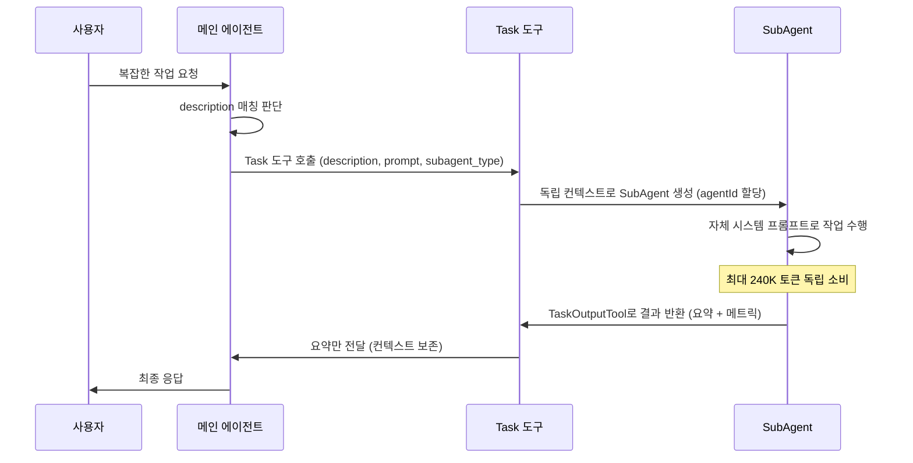
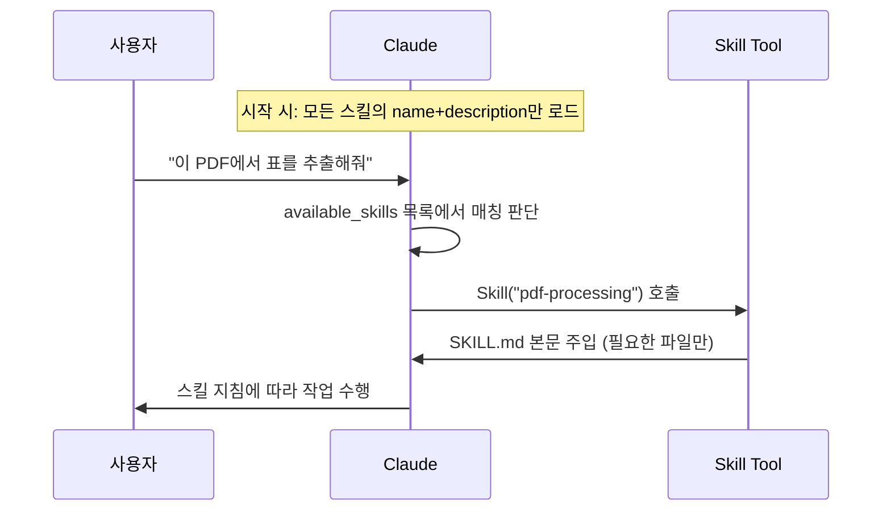
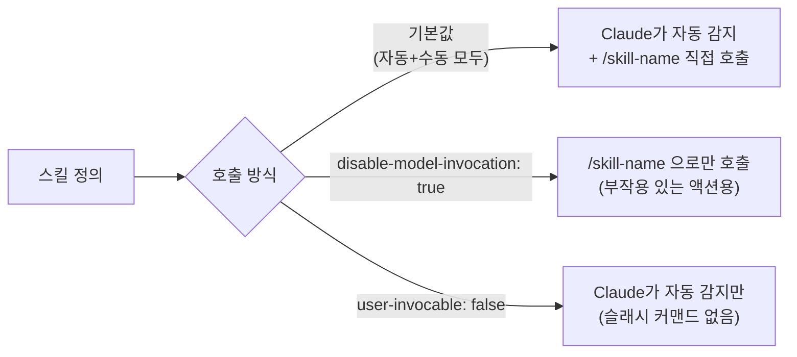
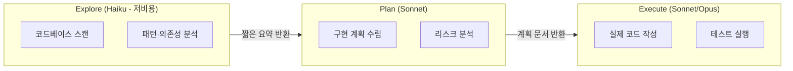
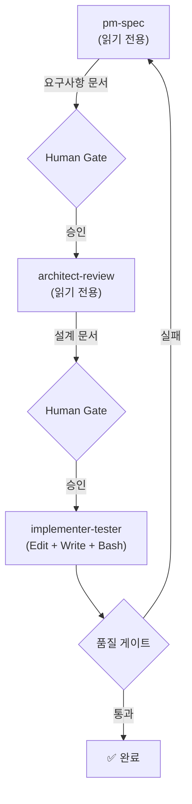

<!--more-->
# Claude Code SubAgent 뜯어보기

Claude Code의 SubAgent는 **독립된 컨텍스트 윈도우에서 특정 작업을 수행하는 특화된 AI 어시스턴트**다. 메인 에이전트의 컨텍스트를 보존하면서 복잡한 작업을 분할·위임하는 핵심 메커니즘으로, 2025년 중반 도입 이후 Claude Code 아키텍처의 중심축이 되었다. 내장 SubAgent 3종(Explore, Plan, General-purpose)과 사용자 정의 SubAgent를 지원하며, 최대 **10개의 동시 병렬 실행**, YAML frontmatter 기반의 마크다운 파일 구성, MCP 도구 상속을 특징으로 한다. Simon Willison(저명 개발자)의 표현처럼 SubAgent는 본질적으로 **"토큰 컨텍스트 최적화 해킹"** 이며, 최대 ~240,000 토큰을 독립적으로 소비한 뒤 짧은 요약만 부모에게 반환한다.

---

## SubAgent의 기본 개념과 에코시스템 내 역할

SubAgent는 특정 유형의 작업을 처리하도록 설계된 독립 AI 인스턴스다. 각 SubAgent는 자체 컨텍스트 윈도우에서 실행되며, 커스텀 시스템 프롬프트·특정 도구 액세스·독립적 권한을 갖는다. Claude가 SubAgent의 description과 일치하는 작업을 만나면 자동으로 위임하고, SubAgent는 독립적으로 작업한 뒤 결과 요약을 반환한다.

Claude Code는 **3종의 내장 SubAgent**를 제공한다.

| SubAgent | 모델 | 권한 | 허용 도구 | 역할 |
|----------|------|------|-----------|------|
| **Explore** | Haiku | 읽기 전용 | Glob, Grep, Read, 제한된 Bash | 코드베이스 빠른 탐색 (quick / medium / very thorough 3단계) |
| **Plan** | Sonnet | 읽기 전용 | Glob, Grep, Read | Plan Mode에서만 호출, 구현 계획 수립 |
| **General-purpose** | Sonnet | 전체 | 전체 도구셋 | 탐색과 수정을 모두 요구하는 복잡한 다단계 작업 |

SubAgent가 Claude Code 에코시스템에서 수행하는 핵심 역할은 세 가지다.

- **컨텍스트 보존** — 수십 개 파일을 읽거나 광범위한 검색을 수행해도 메인 대화는 요약만 받으므로, 장시간 세션에서 컨텍스트 소진을 방지한다.
- **제약 조건 적용** — 각 SubAgent에 허용되는 도구를 제한해 안전한 작업 범위를 강제한다.
- **구성 재사용** — 사용자 수준 SubAgent(`~/.claude/agents/`)를 정의하면 모든 프로젝트에서 동일한 전문 에이전트를 재사용할 수 있다.

공식 문서는 SubAgent와 Agent Team의 차이도 명확히 구분한다.

| 구분 | SubAgent | Agent Team |
|------|----------|------------|
| **실행 범위** | 단일 세션 내 | 별도 세션 간 |
| **결과 보고** | 메인 컨텍스트에 요약 반환 | 세션 간 상호 통신 |
| **성숙도** | 안정 | 실험적 |

---

## 내부 동작 원리: orchestrator-subagent 패턴

Claude Code는 **단일 스레드 마스터 루프**(내부 코드명 "nO")를 사용한다. 모델 응답에 도구 호출이 포함되면 루프가 계속 실행되고, 일반 텍스트만 반환하면 루프가 종료되어 사용자에게 제어권이 돌아간다. 이 설계는 복잡한 멀티에이전트 스웜 대신 **디버깅 용이성·투명성·신뢰성**을 우선시한다.

**Task 도구**가 SubAgent 생성의 유일한 인터페이스다.

| 필드 | 필수 | 설명 |
|------|------|------|
| `description` | ✅ | 3-5단어 요약 |
| `prompt` | ✅ | 전체 작업 지시 내용 |
| `subagent_type` | ✅ | 에이전트 유형 |
| `resume` | ❌ | 이전 에이전트 ID (재개 시) |

실제 호출 시 메인 에이전트가 Task 도구를 통해 SubAgent를 생성하면, SubAgent는 자체 시스템 프롬프트와 기본 환경 정보(작업 디렉토리)만 받고 **메인 Claude Code의 전체 시스템 프롬프트는 전달되지 않는다.** 작업 완료 시 **TaskOutputTool**을 통해 토큰 수·도구 사용 횟수·소요 시간 메트릭과 함께 결과를 반환한다.

컨텍스트 전달은 의도적으로 **단방향·격리형**으로 설계됐다. 메인 에이전트는 Task 도구의 `prompt` 필드를 통해서만 SubAgent에 컨텍스트를 전달하고, SubAgent는 완료 후 요약만 반환한다. SubAgent가 탐색 중 발견한 중간 콘텐츠는 메인 대화의 컨텍스트를 오염시키지 않는다.



각 SubAgent 실행에는 고유한 `agentId`가 할당되며, 대화 기록은 별도 트랜스크립트 파일(`agent-{agentId}.jsonl`)에 저장된다. `resume` 파라미터로 이전 대화를 이어갈 수 있어 **재개 가능한(resumable) 에이전트** 패턴을 지원한다.

> ⚠️ **핵심 아키텍처 제약**: SubAgent는 다른 SubAgent를 생성할 수 없다. 재귀적 증식을 방지하는 의도적 설계로, 위임 깊이는 정확히 1단계로 제한된다. 연쇄적 SubAgent 실행이 필요하면 메인 대화에서 순차적으로 호출해야 한다.

---

## 엔지니어링 아키텍처 심층 분석

### 컨텍스트 관리와 자동 압축

각 SubAgent는 **완전히 독립된 컨텍스트 윈도우**를 가지며, 자체적으로 **98% 사용률에서 자동 압축**(auto-compaction)이 트리거된다. 메인 대화가 압축되어도 SubAgent 트랜스크립트에는 영향이 없다. 트랜스크립트는 세션 내에서 지속되며, 기본 30일 후 자동 정리된다(`cleanupPeriodDays`로 설정 가능). 이 격리 덕분에 SubAgent는 수십 개의 파일과 문서를 탐색하면서도 메인 대화를 깨끗하게 유지할 수 있다.

MCP 도구 검색에서도 최적화가 적용된다. v2.1.7부터 MCP 도구 설명이 컨텍스트 윈도우의 10%를 초과할 경우, Claude Code는 자동으로 ToolSearch를 통한 온디맨드 디스커버리로 전환한다. 이 최적화로 **전체 에이전트 토큰 사용량이 ~46.9% 감소**했다.

### 병렬 실행과 제한사항

Claude Code는 최대 **10개의 동시 SubAgent 태스크**를 지원하며, 초과 요청은 지능적 큐잉으로 처리한다. SubAgent는 기본적으로 백그라운드에서 실행되며, 메인 에이전트는 SubAgent 실행 중에도 사용자 입력을 받을 수 있다. `Ctrl+B`로 실행 중인 태스크를 수동으로 백그라운드 전환할 수 있고, `/tasks` 다이얼로그에서 모든 활성 백그라운드 태스크의 실시간 상태를 확인할 수 있다.

다만 백그라운드 SubAgent에는 중요한 제한이 있다.

| 항목 | 백그라운드 SubAgent |
|------|---------------------|
| MCP 도구 사용 | ❌ 불가 |
| 미승인 권한 요청 | ❌ 자동 거부 |
| `AskUserQuestion` 호출 | ❌ 실패 (에이전트는 계속 진행) |
| 해결책 | 포그라운드에서 재개 |
| 완전 비활성화 | `CLAUDE_CODE_DISABLE_BACKGROUND_TASKS=1` |

### 상태 관리와 Hook 시스템

v2.1.16에서 도입된 **Tasks 시스템**은 DAG(방향성 비순환 그래프) 기반 의존성 추적을 지원한다. `blocks`/`blockedBy` 관계로 태스크 간 선후 관계를 정의할 수 있으며, 상태는 `~/.claude/tasks/` 디렉토리에 저장된다. 도구 사용 후에는 현재 태스크 목록 상태가 시스템 메시지로 자동 주입되어 목표를 잃지 않도록 한다.

SubAgent 라이프사이클은 Hook 시스템과 연동된다. **SubagentStart**(SubAgent 생성 시)와 **SubagentStop**(완료 시, `agent_id`·`agent_transcript_path` 포함) 이벤트를 통해 결정론적 스크립트를 실행할 수 있다.

| Hook 유형 | 설명 |
|-----------|------|
| `command` | 셸 명령 실행 |
| `prompt` | LLM 프롬프트 평가 |
| `agent` | 도구를 사용하는 에이전트 검증자 |

SubAgent의 frontmatter에서도 `PreToolUse`·`PostToolUse`·`Stop` Hook을 직접 정의할 수 있으며, 해당 SubAgent 실행이 완료되면 자동 정리된다.

---

## SubAgent 구성 방법: 파일, CLI, SDK

### 마크다운 파일 기반 정의

SubAgent는 YAML frontmatter가 포함된 마크다운 파일로 정의된다. `/agents` 명령으로 대화형 생성이 가능하고, 수동으로 파일을 작성할 수도 있다.

```yaml
---
name: code-reviewer
description: Expert code reviewer. Use proactively after code changes.
tools: Read, Grep, Glob, Bash
disallowedTools: Write, Edit
model: sonnet
permissionMode: default
skills: security-checklist
memory: user
---

당신은 시니어 코드 리뷰어입니다. 코드 품질, 보안, 모범 사례에 집중하세요.
각 이슈를 설명하고, 현재 코드를 보여주고, 개선된 버전을 제공하세요.
```

주요 frontmatter 필드는 다음과 같다.

| 필드 | 설명 | 가능한 값 |
|------|------|-----------|
| `name` | 고유 식별자 | 임의 문자열 |
| `description` | Claude가 자동 위임 판단에 사용하는 설명 **(핵심)** | 임의 문자열 |
| `tools` | 허용 도구 목록 (생략 시 MCP 포함 모든 도구 상속) | `Read, Grep, Glob, Bash, ...` |
| `disallowedTools` | 거부 도구 목록 | `Write, Edit, ...` |
| `model` | 사용할 모델 | `sonnet` / `opus` / `haiku` / `inherit` |
| `permissionMode` | 권한 모드 | `default` / `acceptEdits` / `bypassPermissions` / `plan` / `ignore` |
| `skills` | 자동 로드할 스킬 | 스킬 이름 |
| `memory` | 세션 간 지속 메모리 스코프 (`MEMORY.md` 첫 200줄 자동 주입) | `user` / `project` / `local` |

### Tools 전체 참조

`tools` / `disallowedTools` 필드에 지정하는 값들이다. Claude Code에는 다음 내장 도구들이 있으며, SubAgent에 따라 허용 범위를 제한하는 것이 보안과 비용 관리의 핵심이다.

#### 파일 탐색 도구

| 도구 | 용도 | 주요 파라미터 | SubAgent 권장 여부 |
|------|------|--------------|:-----------------:|
| **Glob** | 파일명 패턴으로 파일 찾기 | `pattern` (필수), `path` (옵션) | ✅ 탐색 전용 |
| **Grep** | 파일 내용에서 텍스트/정규식 검색 (ripgrep 기반) | `pattern`, `output_mode`, `glob`, `type`, `-A/-B/-C` | ✅ 탐색 전용 |
| **LS** | 디렉토리 목록 조회 | `path` | ✅ 탐색 전용 |

**Glob vs Grep 선택 기준:**
- 파일명으로 찾을 때 → `Glob` (`**/*.kt`, `src/**/*.java`)
- 파일 안의 내용으로 찾을 때 → `Grep` (`pattern: "class Foo"`)
- 넓은 범위의 탐색이 필요할 때 → `Task` 도구로 Explore SubAgent 위임

#### 파일 읽기/쓰기 도구

| 도구 | 용도 | 주요 파라미터 | 주의사항 |
|------|------|--------------|----------|
| **Read** | 파일 읽기 (텍스트, 이미지, PDF, Jupyter 노트북 지원) | `file_path` (필수), `offset`, `limit` | 2000줄 기본 제한, 2000자 초과 줄은 잘림 |
| **Write** | 새 파일 생성 또는 전체 덮어쓰기 | `file_path`, `content` | 기존 내용 완전 교체 주의 |
| **Edit** | 파일 내 특정 문자열 교체 (단일) | `file_path`, `old_string`, `new_string` | `old_string`이 파일에 정확히 1회 존재해야 함 |
| **MultiEdit** | 파일 내 여러 위치 일괄 교체 | `file_path`, `edits[]` | 여러 수정을 한 번에 처리 |
| **NotebookRead** | Jupyter 노트북 읽기 | `notebook_path` | 셀 + 출력 포함 |
| **NotebookEdit** | Jupyter 노트북 셀 편집 | `notebook_path`, `cell_id`, `new_source` | |

> 💡 **Bash 대신 전용 도구 사용 원칙**: `cat` 대신 `Read`, `grep` 대신 `Grep`, `find` 대신 `Glob`, `sed/awk` 대신 `Edit`, `echo >` 대신 `Write`를 사용하는 것이 Claude Code의 공식 권장 사항이다.

#### 실행 도구

| 도구 | 용도 | 주요 파라미터 | 주의사항 |
|------|------|--------------|----------|
| **Bash** | 셸 명령 실행 (영속 세션) | `command` (필수), `description`, `timeout` (최대 600000ms), `run_in_background` | 파일 작업은 전용 도구 우선 사용 |
| **BashOutput** | 백그라운드 Bash 결과 읽기 | `background_task_id` | `run_in_background: true`로 실행한 명령의 결과 조회 |
| **KillShell** | 백그라운드 프로세스 종료 | `pid` | |

#### 에이전트·태스크 도구

| 도구 | 용도 | 주요 파라미터 |
|------|------|--------------|
| **Task** | SubAgent 생성 및 위임 | `subagent_type`, `prompt`, `description`, `resume` |
| **TodoRead** | 현재 태스크 목록 읽기 | — |
| **TodoWrite** | 태스크 목록 생성/업데이트 | `todos[]` |

#### 웹 도구

| 도구 | 용도 | 주요 파라미터 |
|------|------|--------------|
| **WebSearch** | 웹 검색 | `query` |
| **WebFetch** | 특정 URL 페이지 가져오기 | `url` |

#### 기타 도구

| 도구 | 용도 |
|------|------|
| **ExitPlanMode** (= `exit_plan_mode`) | Plan Mode 종료, 실행 단계로 전환 |
| **SlashCommand** | 슬래시 커맨드 실행 |

#### 역할별 권장 도구 조합

커뮤니티(VoltAgent 100+ SubAgent 분석)에서 수렴된 역할별 표준 도구 조합이다.

| SubAgent 역할 | 권장 tools | 배제할 tools |
|--------------|-----------|-------------|
| 읽기 전용 리뷰어 (코드 리뷰, 감사) | `Read, Grep, Glob` | `Write, Edit, Bash` |
| 리서치·분석 | `Read, Grep, Glob, WebFetch, WebSearch` | `Write, Edit` |
| 코드 작성·개발 | `Read, Write, Edit, Bash, Glob, Grep` | — |
| 테스트 실행 | `Read, Bash, Grep, Glob` | `Write, Edit` |
| 문서 작성 | `Read, Write, Glob, Grep` | `Bash` |
| 탐색 전용 (Explore 유형) | `Glob, Grep, Read, Bash` (읽기 전용 Bash만) | `Write, Edit, MultiEdit` |

---

파일 저장 위치에 따라 우선순위가 달라진다.

| 위치 | 경로 | 우선순위 | 특징 |
|------|------|----------|------|
| 프로젝트 SubAgent | `.claude/agents/` | 🥇 최고 | 팀과 공유 가능 |
| 사용자 SubAgent | `~/.claude/agents/` | 🥈 | 모든 프로젝트에서 사용 |
| 플러그인 에이전트 | `plugin-root/agents/` | 🥈 (동급) | 플러그인 번들 포함 |

### CLI와 SDK를 통한 프로그래밍적 정의

`--agents` CLI 플래그로 JSON 형태의 SubAgent를 세션에 주입할 수 있다:

```bash
claude --agents '{
  "code-reviewer": {
    "description": "Expert code reviewer",
    "prompt": "You are a senior code reviewer...",
    "tools": ["Read", "Grep", "Glob", "Bash"],
    "model": "sonnet"
  }
}'
```

SDK(Python/TypeScript)에서는 `AgentDefinition` 객체로 정의한다:

```python
from claude_agent_sdk import query, ClaudeAgentOptions, AgentDefinition

async for message in query(
    prompt="인증 모듈을 리뷰해주세요",
    options=ClaudeAgentOptions(
        allowed_tools=["Read", "Grep", "Glob", "Task"],
        agents={
            "code-reviewer": AgentDefinition(
                description="Expert code reviewer",
                prompt="당신은 시니어 코드 리뷰어입니다...",
                tools=["Read", "Grep", "Glob"],
                model="sonnet"
            )
        }
    )
): ...
```

MCP 도구 접근은 `mcp__{서버명}__{도구명}` 명명규칙을 사용하며 와일드카드(`mcp__github__*`)도 지원한다.

### CLAUDE.md와의 관계

중요한 점은, **CLAUDE.md의 내용이 SubAgent에 자동 전파되지 않는다**는 것이다. 공식 문서에서는 SubAgent가 프로젝트의 CLAUDE.md 지침을 상속한다고 언급하지만, 실제 GitHub 이슈([#8395](https://github.com/anthropics/claude-code/issues/8395), [#18352](https://github.com/anthropics/claude-code/issues/18352))에서 사용자들은 이 동작이 불완전하다고 보고하고 있다.

| 해결책 | 설명 | 권장 여부 |
|--------|------|-----------|
| 시스템 프롬프트에 직접 포함 | 각 SubAgent `.md` 파일 본문에 규칙 명시 | ✅ 가장 확실 |
| `skills` 필드로 공통 스킬 로드 | 공통 규칙을 스킬 파일로 분리 후 자동 로드 | ✅ 재사용성 높음 |
| `context: fork` 활용 (v2.1+) | Skill이 SubAgent 컨텍스트에 자동 주입되는 방식으로 우회 | ✅ 가장 우아한 해법 |
| CLAUDE.md 상속 기대 | 현재 불완전하게 동작 | ❌ 비권장 |

### context: fork — Skills와 SubAgent의 교차점 (v2.1+)

Claude Code 2.1에서 추가된 `context: fork`는 CLAUDE.md 미전파 문제를 구조적으로 해결하는 가장 우아한 방법이다. 스킬 frontmatter에 `context: fork`를 선언하면, 그 스킬은 독립된 SubAgent 컨텍스트에서 실행되며 스킬 내용이 해당 SubAgent의 시스템 프롬프트에 자동 주입된다.

이것은 **"SubAgent 안에서 스킬 실행"의 역방향 관계**다. Skills in a subagent에서는 SubAgent가 시스템 프롬프트를 제어하고 스킬 내용을 로드한다. `context: fork` in a skill에서는 스킬 내용이 지정한 에이전트에 주입된다. 둘 다 같은 내부 시스템을 사용한다.

```yaml
# .claude/skills/project-conventions.md
---
name: project-conventions
description: 프로젝트 공통 규칙 (Kotlin 컨벤션, 아키텍처 패턴 등)
context: fork
agent: code-reviewer   # 주입할 에이전트 타입 지정
allowed_tools:
  - Read
  - Grep               # 필요한 도구만 허용
---

# 여기에 CLAUDE.md에 넣었던 규칙들을 작성
- Kotlin 코딩 컨벤션
- Clean Architecture 레이어 규칙
- 테스트 작성 기준 (JUnit5, MockK)
```

`context: fork`를 사용하면 컨텍스트 흐름이 달라진다.

```
기존: CLAUDE.md 규칙 → 메인 에이전트 (✅) / SubAgent (❌ 전파 안 됨)

context: fork 사용:
  공통 규칙 → Skill 파일에 작성
             → context: fork로 호출 시
             → Skill 내용이 SubAgent 시스템 프롬프트에 주입 (✅)
```

이 방식의 핵심 장점은 CLAUDE.md의 프로젝트 규칙을 각 SubAgent에 복붙하는 대신, **Skill이 규칙의 운반체 역할**을 하므로 한 곳에서 관리할 수 있다는 점이다. 규칙이 바뀌면 Skill 파일만 수정하면 된다.

`context: fork`로 지정 가능한 에이전트 타입은 다음과 같다.

| `agent` 값 | 설명 |
|------------|------|
| `general-purpose` | 기본값, 전체 도구 접근 |
| `Plan` | 계획·설계 특화 |
| `Explore` | 코드베이스 탐색 특화 (Haiku 모델, 읽기 전용) |
| 커스텀 에이전트 이름 | `.claude/agents/`에 정의한 사용자 정의 에이전트 |

> ⚠️ **알려진 버그 (GitHub 이슈 #17283)**: Skill 도구를 통해 호출할 때 `context: fork`와 `agent:` 필드가 무시되고 메인 대화 컨텍스트에서 실행되는 버그가 보고돼 있다. 2025년 1월 기준 아직 완전히 안정화된 기능은 아니므로, 중요한 워크플로우에 적용 전 반드시 동작을 검증해야 한다.

### Skills, Commands, SubAgents의 수렴 (v2.1의 큰 그림)

`context: fork`는 단순한 기능 추가가 아니라 Claude Code 아키텍처의 방향을 보여준다. 기존에는 Skills(메인 컨텍스트 실행) vs SubAgents(격리 컨텍스트 실행)가 완전히 별개의 추상화였다. `context: main | fork` 스위치 하나로, 이제 같은 로직을 메인 컨텍스트에서 실행할지 격리된 컨텍스트에서 실행할지를 선택할 수 있다. Skills와 SubAgents가 하나의 추상화로 수렴하는 과정에 있다.

---

## Skills 완전 가이드

### Skills란 무엇인가?

Skills는 Claude Code에 **도메인 특화 지식·워크플로우·도구 통합 능력을 주입하는 재사용 가능한 패키지**다. "전문가 온보딩 가이드"처럼 생각하면 된다. 반복적으로 같은 지침을 프롬프트에 넣는 대신, 한 번 작성해두면 Claude가 관련 상황을 감지할 때마다 자동으로 로드한다.

기술적으로는 **"온디맨드 프롬프트 확장"** 메커니즘이다. 시작 시점에 모든 스킬의 `name`과 `description`만 시스템 프롬프트에 로드된다. 실제 `SKILL.md` 본문은 Claude가 해당 스킬을 선택했을 때만 읽어오므로, **로드된 스킬 수에 관계없이 컨텍스트 패널티가 없다.**



### Skills vs SubAgent: 언제 무엇을 쓸까?

| 비교 항목 | Skills | SubAgent |
|-----------|--------|----------|
| **실행 컨텍스트** | 메인 대화 (기본값) | 격리된 독립 컨텍스트 |
| **중간 결과** | 메인 대화에 노출 | 요약만 반환, 메인 대화 보존 |
| **재사용** | 모든 대화에서 자동 로드 | 세션 내 위임 |
| **주요 용도** | 지식·규칙·워크플로우 주입 | 복잡한 작업 격리·위임 |
| **파일 구조** | 디렉토리 (`skill-name/SKILL.md`) | 단일 `.md` 파일 |
| **컨텍스트 비용** | 본문은 온디맨드 로드 → 낮음 | 독립 컨텍스트 윈도우 → 높음 |
| **컨텍스트 격리 필요** | ❌ | ✅ |
| **상태 유지** | `memory` 필드로 가능 | 세션 내에서만 |

**Skills가 더 적합한 경우:**
- 코딩 컨벤션, 아키텍처 패턴, 팀 규칙을 Claude에게 주입할 때
- 메인 대화 흐름을 유지하면서 전문 지식만 추가하고 싶을 때
- 프로젝트 전반에서 반복되는 짧은 워크플로우 (`/commit`, `/review`)

**SubAgent가 더 적합한 경우:**
- 대량의 파일 탐색·분석 결과를 메인 대화에서 격리하고 싶을 때
- 병렬 실행이 필요한 독립적인 작업들

### 디렉토리 구조

```
skill-name/
├── SKILL.md           ← 필수: frontmatter + 지침
├── scripts/           ← 옵션: Python/Bash 실행 스크립트
│   └── extract.py
├── references/        ← 옵션: 필요 시 로드되는 참조 문서
│   ├── api-spec.md
│   └── patterns.md
└── assets/            ← 옵션: 출력에 사용되는 템플릿·폰트 등
    └── template.docx
```

저장 위치:
- **사용자 전역**: `~/.claude/skills/skill-name/`
- **프로젝트 전용**: `.claude/skills/skill-name/`
- `--add-dir` 플래그로 지정한 디렉토리의 `.claude/skills/`도 자동 로드

### Frontmatter 필드 전체 참조

```yaml
---
name: kotlin-reviewer          # 필수: 64자 이하, 소문자·숫자·하이픈만
description: |                 # 필수: 1024자 이하, 자동 호출 판단의 핵심
  Kotlin 코드를 리뷰한다. PR 리뷰, 코드 품질 검사,
  아키텍처 패턴 확인 시 사용. "리뷰", "코드 검사",
  "PR 확인" 등의 키워드에 반응.
allowed-tools: Read, Grep, Glob  # 옵션: 허용 도구 제한
context: main                    # 옵션: main(기본) | fork
agent: code-reviewer             # 옵션: context:fork 시 주입할 에이전트
disable-model-invocation: true   # 옵션: true면 사용자만 /skill-name으로 호출 가능
user-invocable: false            # 옵션: false면 Claude만 자동 로드, /명령어 없음
---
```

| 필드 | 필수 | 설명 |
|------|------|------|
| `name` | ✅ | 슬래시 커맨드 이름이 됨 (`/name`) |
| `description` | ✅ | Claude의 자동 호출 판단 기준. **"when to use"를 여기에 모두 서술** |
| `allowed-tools` | ❌ | 이 스킬 실행 시 허용할 도구 목록 |
| `context` | ❌ | `main`(기본) 또는 `fork`(격리 SubAgent에서 실행) |
| `agent` | ❌ | `context: fork` 시 주입할 에이전트 타입 |
| `disable-model-invocation` | ❌ | `true`: 사용자만 호출 가능 (배포, 커밋 등 부작용 있는 액션에 사용) |
| `user-invocable` | ❌ | `false`: Claude만 자동 로드, `/명령어` 없음 (배경 지식 주입용) |

> 💡 **description 작성 원칙**: `description`은 시스템 프롬프트에 직접 주입된다. 3인칭으로 작성하고, "what the skill does"와 "when to use it"을 모두 포함해야 한다. Body에 "When to Use" 섹션을 넣어도 Body는 스킬 선택 후에 로드되므로 의미가 없다.
>
> 실험에 따르면 description 최적화만으로 자동 활성화율이 20% → 50%로, 예시 추가 시 90%까지 향상된다.

### 호출 방식: 자동 vs 수동



**자동 호출 vs 수동 호출 선택 기준:**

| 상황 | 설정 | 예시 |
|------|------|------|
| 자유롭게 언제든 쓰는 지식 | 기본값 | `kotlin-conventions`, `architecture-guide` |
| 부작용이 있는 액션 (Claude가 혼자 실행하면 안 됨) | `disable-model-invocation: true` | `/commit`, `/deploy`, `/send-slack` |
| 배경 지식으로만 쓸 것 (명령어로 의미 없음) | `user-invocable: false` | `legacy-system-context`, `team-glossary` |

### Progressive Disclosure 패턴

Skills의 핵심 설계 원칙은 **Progressive Disclosure(점진적 공개)**다. 처음엔 최소한의 정보만 노출하고, 필요해질 때 더 자세한 내용을 로드한다. 컨텍스트 윈도우는 공유 자원이므로, 필요하지 않은 내용을 미리 로드하지 않는다.

```
SKILL.md 500줄 이하 권장 (기본 지침만)
    ↓ 필요 시 Claude가 Read로 접근
references/api-spec.md     ← API 명세 전체
references/patterns.md     ← 세부 패턴 가이드
    ↓ 실행 시에만
scripts/extract.py         ← 스크립트 출력만 컨텍스트 소비
```

이 구조 덕분에 방대한 API 문서, 대규모 예시, 데이터셋을 번들해도 **실제로 접근되기 전까지 컨텍스트 토큰을 소비하지 않는다.**

### Skill 설계 철학

#### 공식 문서가 말하는 Skill의 본질

Anthropic 공식 블로그(Skills Explained, 2025.11)는 Skills의 용도를 명확히 정의한다.

> "**Use Skills when**: You have procedures or expertise that you'll need repeatedly. Skills are proactive—Claude knows when to apply them—and persistent across conversations."
> — Anthropic 공식 블로그

즉 Skill의 핵심 가치는 **반복 사용**과 **자동 적용**이다. 한 번만 쓸 지침은 프롬프트로 충분하고, 여러 대화에 걸쳐 반복될 절차나 지식이 Skill의 적합한 대상이다.

Anthropic best practices 문서는 Skill 개발의 출발점으로 다음 방법을 권장한다.

> "Complete a task without a Skill first. As you work, you'll naturally provide context and procedural knowledge. Notice what information you repeatedly provide — that's your Skill."
> — Anthropic Skill Authoring Best Practices

이는 실제로 반복되는 패턴을 먼저 발견한 뒤 Skill로 추출하라는 접근이다.

#### Skills의 두 가지 콘텐츠 유형

공식 문서는 Skill 콘텐츠를 두 유형으로 구분한다.

| 유형 | 설명 | 예시 |
|------|------|------|
| **Reference content** | Claude가 현재 작업에 적용할 지식·컨벤션·도메인 규칙 | 코딩 컨벤션, 아키텍처 패턴, 팀 용어집 |
| **Workflow instructions** | Claude가 따를 단계별 절차 | PR 리뷰 체크리스트, 배포 절차, 버그 분석 프로토콜 |

두 유형 모두 유효하며, 하나의 Skill이 둘을 함께 포함할 수도 있다.

#### 구체적 절차와 예시가 일관성을 높인다 (공식 권장)

Anthropic best practices는 출력 품질이 예시에 의존하는 Skill의 경우 **입력/출력 쌍(예시)** 을 명시적으로 제공하도록 권장한다. 이는 Claude가 매번 다른 형식으로 응답하는 것을 방지한다.

```yaml
---
name: commit-message
description: |
  커밋 메시지를 컨벤션에 맞게 작성한다.
  "커밋", "commit message" 작성 시 사용.
---

## Commit Message Format

**Example 1:**
Input: JWT 기반 사용자 인증 추가
Output:
feat(auth): implement JWT-based authentication
Add login endpoint and token validation middleware

**Example 2:**
Input: 리포트에서 날짜가 잘못 표시되는 버그 수정
Output:
fix(reports): correct date formatting in timezone conversion
Use UTC timestamps consistently across report generation
```

---

> 💡 **편집자 권장 관점** — 아래 내용은 공식 문서에서 직접 제시하는 프레임워크는 아니지만, Skill 설계 경험에서 도출된 실용적 관점으로 참고할 만하다.

#### [권장 관점] 반복 프롬프트를 Skill로 만들 때의 핵심 차이

반복 프롬프트를 Skill로 만드는 것은 좋은 출발점이지만, "자주 쓰는 프롬프트 모음"에 그치면 재현성이 낮다. Claude는 확률 모델이기 때문에 사고 경로를 명시하지 않으면 매번 결과가 달라질 수 있다.

```yaml
# 단순 요청형 (재현성 낮음)
---
name: pr-review
description: PR을 꼼꼼히 리뷰한다.
---
Review this PR carefully.
Check architecture, coroutines, and style.
```

```yaml
# 절차 명시형 (재현성 높음)
---
name: pr-review-protocol
description: |
  PR 코드 리뷰를 단계별 프로토콜로 수행한다.
  "PR 리뷰", "코드 리뷰", "diff 확인" 시 사용.
---

## Input Required
- 리뷰 대상 PR diff 또는 파일 목록

## Review Steps (순서 고정)
1. Module Boundary Check — 레이어 경계 침범 여부
2. Threading Safety — dispatcher, scope, blocking 위험
3. Error Handling — 예외 누락, 침묵 catch
4. Test Coverage — 핵심 경로 커버 여부
5. Regression Risk — 기존 기능 영향 범위

## Output Format
각 항목: 근거 / 위험도 (Low·Medium·High) / 구체적 수정안
```

#### [권장 관점] CLAUDE.md, Rules, Skills의 역할 구분

| 구성 요소 | 역할 | 성격 |
|-----------|------|------|
| `CLAUDE.md` / Rules | 절대 원칙, 금지 사항, 프로젝트 맥락 | 선언적 |
| Skills | 반복 작업의 실행 절차, 도메인 지식 | 절차적·지식적 |
| SubAgent | 격리된 컨텍스트에서 Skills를 적용하는 실행 단위 | 위임 |

이 구분이 명확해지면 어떤 내용을 어디에 두어야 할지 결정이 쉬워진다. Rules가 "레이어 간 직접 참조 금지"라는 원칙이라면, Skill은 "코드 리뷰 시 1단계로 레이어 경계 침범 여부를 확인하고 위반 시 심각도와 수정안을 제시한다"는 집행 절차다.

---

## 실용적 활용 패턴과 베스트 프랙티스

### 커뮤니티에서 검증된 가장 효과적인 패턴

Claude Code 핵심 엔지니어 **Adam Wolf**의 조언에 따르면, SubAgent는 **"정보를 탐색하고 짧은 요약을 메인 대화에 반환할 때 가장 잘 작동한다."** 즉, SubAgent에게 구현을 맡기는 것보다 컨텍스트 수집·분석을 위임하고 실제 실행은 메인 에이전트가 담당하는 **Explore → Plan → Execute 패턴**이 커뮤니티 합의 사항이다.



**PubNub 사례**가 대표적이다. PubNub 팀은 애드혹 프롬프트에서 3단계 SubAgent 파이프라인(`pm-spec → architect-review → implementer-tester`)으로 마이그레이션했다. PM과 Architect는 읽기 중심 권한만, Implementer는 Edit/Write/Bash를 부여했다. SubagentStop Hook으로 단계 간 전환을 자동화하고, 각 핸드오프에서 사람의 승인을 받는 human-in-the-loop 패턴을 적용했다.



**zhsama의 Spec Workflow System**은 더 정교한 사례로, `spec-analyst → spec-architect → spec-planner → spec-developer → spec-tester → spec-reviewer → spec-validator`의 7단계 파이프라인에 품질 게이트를 삽입해 실패 시 이전 단계로 루프백하는 구조를 구현했다.

### 자동 위임을 활성화하는 핵심 기법

HackerNews와 블로그에서 반복적으로 지적되는 문제가 있다. **SubAgent가 정의되어 있어도 Claude가 직접 작업을 수행하고 SubAgent를 호출하지 않는 경우가 빈번하다**는 것이다.

| 방법 | 예시 |
|------|------|
| `description` 필드에 `"Use proactively"` 문구 포함 | `"Use proactively after code changes"` |
| CLAUDE.md에 명시적 위임 지침 추가 | `"데이터베이스 관련 작업에는 database-admin 에이전트를 사용하라"` |
| 프롬프트에서 SubAgent를 명시적으로 요청 | `"use the code-reviewer subagent to check the auth module"` |

### 추천 사용 시나리오

SubAgent가 특히 효과적인 상황은 다음과 같다.

| 시나리오 | 설명 |
|----------|------|
| **대규모 코드베이스 탐색** | Explore SubAgent가 Haiku 모델로 빠르고 저렴하게 수십 개 파일을 스캔한 뒤 요약만 반환 |
| **코드 리뷰** | 별도 컨텍스트에서 보안·스타일·테스트 커버리지를 동시 병렬 검사 |
| **디버깅** | 3개 SubAgent로 버그 추적·가정 검증·대안 제시를 병렬 수행 |
| **문서·API 분석** | 외부 문서를 대량 읽어 요약본만 메인 에이전트에 전달 |
| **TDD 워크플로우** | 테스트 작성·실행·결과 분석을 격리된 컨텍스트에서 수행 |

반면 SubAgent보다 **Skills가 더 적합한 경우**는, 메인 대화 컨텍스트에서 재사용 가능한 프롬프트가 필요할 때(격리가 불필요할 때)다.

---

## 한계점, 비용, 주의사항

### 토큰 비용의 급격한 증가

SubAgent 활용 시 가장 큰 현실적 제약은 토큰 소비다. GitHub 가이드(rvalen1123)에 따르면, **3개의 활성 SubAgent가 있는 세션은 일반적으로 ~3-4배의 토큰을 소비**한다. 각 SubAgent가 독립 컨텍스트 윈도우를 유지하기 때문이다.

| 상황 | 토큰 소비 배율 |
|------|---------------|
| 일반 세션 | 1x |
| SubAgent 1개 활성 | ~1.5x |
| SubAgent 3개 활성 | **~3-4x** |
| Opus 모델 4개 병렬 | 주간 24시간 한도 → **실질 6시간** |

Opus 모델 기준 주간 24시간 제한이 있는 상황에서 4개 병렬 에이전트를 실행하면 **실질 작업 시간은 6시간으로 감소**한다(GitHub 이슈 #4807). 사용자들은 SubAgent가 메인 컨텍스트에서 3K 토큰이면 될 작업에 **160K 토큰을 소비**하는 사례도 보고했다.

비용 제어 전략으로는 탐색 작업에 **Haiku 모델을 적극 활용**하고, 구현 작업에만 Sonnet/Opus를 배정하는 모델 계층화가 효과적이다. 각 SubAgent의 `model` 필드를 적절히 설정하면 동일한 작업을 훨씬 저렴하게 처리할 수 있다.

### 아키텍처적 제한사항

| 제한 | 내용 | 우회 방법 |
|------|------|-----------|
| **중첩 불가** | SubAgent는 다른 SubAgent를 생성할 수 없다 | 메인 대화에서 순차적으로 체이닝 |
| **컨텍스트 단절 (Context Amnesia)** | 각 SubAgent는 빈 슬레이트에서 시작 | `prompt` 필드로 충분한 컨텍스트 전달 |
| **CLAUDE.md 미전파** | 프로젝트 규칙이 자동으로 SubAgent에 전달되지 않을 수 있다 | 시스템 프롬프트 직접 포함 또는 `skills` 활용 |
| **합성 문제 (Synthesis Problem)** | 여러 SubAgent 결과를 통합하는 "reduce" 단계가 비결정적 결과를 낳을 수 있다 | 명확한 output 포맷 지정 |
| **UI 플리커링** | 다수의 병렬 SubAgent 실행 시 Claude Code 터미널에서 화면 깜빡임 발생 | 병렬 수 제한 |

### 보안과 권한 관리

`permissionMode: bypassPermissions`는 모든 권한 확인을 건너뛰므로 극히 신중하게 사용해야 한다. 부모 에이전트가 `bypassPermissions`를 사용하면 이것이 SubAgent에도 강제 적용되며 재정의가 불가능하다. 엔터프라이즈 환경에서는 MCP 서버 접근 허용/거부 목록을 각 SubAgent별로 세밀하게 관리하고, 서버 설정 변경 시마다 권한을 재검토해야 한다.

---

## 결론: SubAgent를 제대로 활용하기 위한 핵심 원칙

Claude Code SubAgent의 본질은 **컨텍스트 관리 도구**다. 독립적 AI 워커가 아닌, 메인 에이전트의 제한된 컨텍스트 윈도우를 효율적으로 활용하기 위한 아키텍처 패턴이다. 가장 효과적인 활용법은 SubAgent를 "정보 수집가"로 사용하고 메인 에이전트를 "실행자"로 유지하는 것이다. 모든 것을 SubAgent에 위임하는 "신(God) 에이전트" 접근은 토큰 폭발과 비결정적 결과를 초래한다.

커뮤니티가 수렴한 핵심 원칙은 명확하다.

| 원칙 | 실천 방법 |
|------|-----------|
| **단일 책임 설계** | 각 SubAgent는 하나의 명확한 역할만 담당 |
| **최소 권한** | `tools` 필드로 필요한 도구만 허용, `disallowedTools`로 위험 도구 차단 |
| **명확한 description** | `"Use proactively when..."` 문구로 자동 위임 유도 |
| **모델 계층화** | 탐색=Haiku, 구현=Sonnet, 복잡한 판단=Opus |
| **충분한 컨텍스트 전달** | `prompt` 필드에 SubAgent가 필요한 모든 맥락 포함 |

아직 CLAUDE.md 자동 전파, 중첩 SubAgent, 구조화된 출력 스키마 같은 기능이 부재하지만, 100개 이상의 커뮤니티 SubAgent 정의와 활발한 플러그인 마켓플레이스 생태계가 이 격차를 빠르게 메우고 있다. SubAgent는 Claude Code를 단순한 코딩 어시스턴트에서 **오케스트레이션 가능한 에이전트 플랫폼**으로 전환시키는 핵심 기능이며, 그 설계 철학—"복잡한 스웜보다 통제된 단순성"—이 실용적 가치의 근원이다.

---

## 참고 자료

| 구분 | 링크 |
|------|------|
| 📖 공식 문서 (한국어) | [code.claude.com/docs/ko/sub-agents](https://code.claude.com/docs/ko/sub-agents) |
| 📖 공식 문서 (영어) | [docs.anthropic.com/en/docs/claude-code/sub-agents](https://docs.anthropic.com/en/docs/claude-code/sub-agents) |
| 📖 SDK SubAgent | [platform.claude.com/docs/en/agent-sdk/subagents](https://platform.claude.com/docs/en/agent-sdk/subagents) |
| 🔧 커뮤니티 SubAgent 100+ | [github.com/VoltAgent/awesome-claude-code-subagents](https://github.com/VoltAgent/awesome-claude-code-subagents) |
| 🔧 멀티에이전트 오케스트레이션 예시 | [github.com/wshobson/agents](https://github.com/wshobson/agents) |
| 📝 PubNub 베스트 프랙티스 | [pubnub.com/blog/best-practices-for-claude-code-sub-agents](https://www.pubnub.com/blog/best-practices-for-claude-code-sub-agents/) |
| 📝 Task Tool vs SubAgent 비교 | [ibuildwith.ai - Task Tool vs Subagents](https://www.ibuildwith.ai/blog/task-tool-vs-subagents-how-agents-work-in-claude-code/) |
| 📝 내부 아키텍처 분석 | [deepwiki.com - agent-system-and-subagents](https://deepwiki.com/anthropics/claude-code/3.1-agent-system-and-subagents) |
| 📝 흔한 실수 & 베스트 프랙티스 | [claudekit.cc - SubAgent 오해와 진실](https://claudekit.cc/blog/vc-04-subagents-from-basic-to-deep-dive-i-misunderstood) |
| 📝 Anthropic 엔지니어링 블로그 | [anthropic.com - building-agents-with-the-claude-agent-sdk](https://www.anthropic.com/engineering/building-agents-with-the-claude-agent-sdk) |
| 💬 HackerNews 토론 | [news.ycombinator.com/item?id=44686726](https://news.ycombinator.com/item?id=44686726) |
| 🐛 GitHub 이슈 (CLAUDE.md 미전파) | [github.com/anthropics/claude-code/issues/8395](https://github.com/anthropics/claude-code/issues/8395) |

