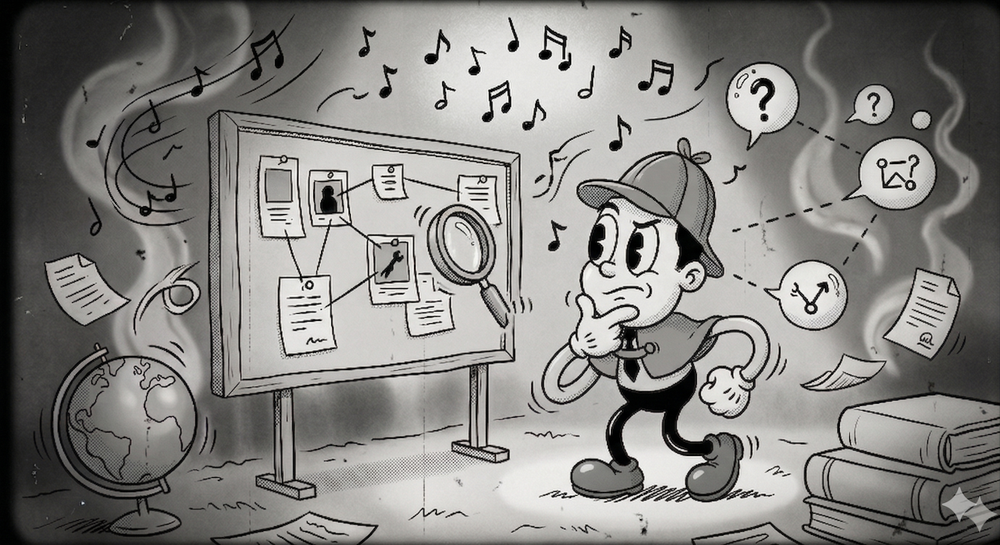
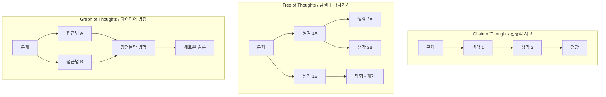
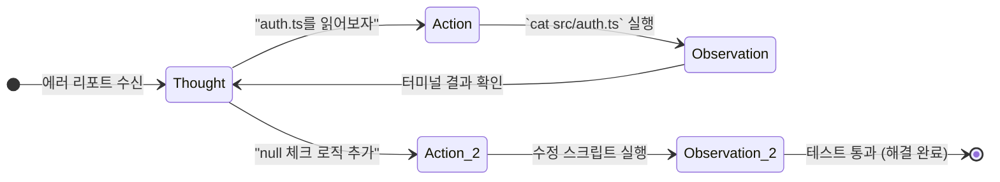
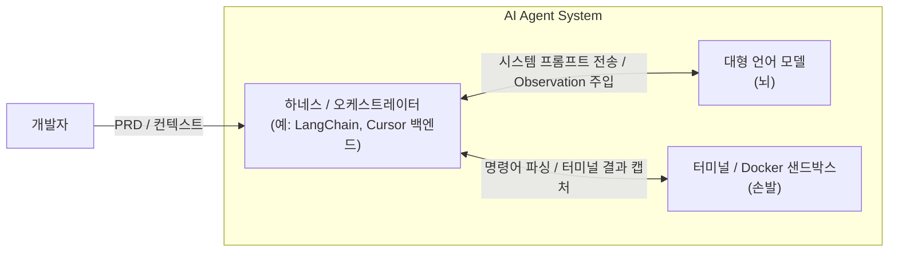
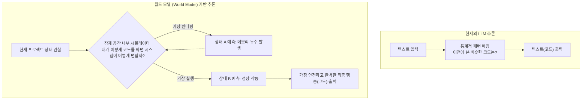

> 작성 목적: Claude Code, Cursor, Codex 같은 AI 코딩 에이전트가 어떻게 작동하는지, LLM 추론부터 월드 모델까지 공부하며 정리한 기록입니다.
>
> Co-authored with OpenClaw

<!--more-->

최근 Claude Code, Cursor, Codex 같은 AI 코딩 에이전트(Agent)들을 현업에서 매일같이 사용하면서 문득 이런 의문이 들었다.

_"얘네들은 대체 어떻게 내 프로젝트의 거대한 폴더 구조를 파악하고, 여러 파일을 넘나들며 버그를 찾고, 코드를 수정하는 걸까? 단순히 '다음 단어'를 예측하는 모델이라면서, 어떻게 이런 복잡한 '생각(Reasoning)'을 해내는 거지?"_

단순히 질문에 답하는 챗봇을 넘어, 내 터미널에서 직접 명령어를 실행하고 파일을 읽고 쓰는 이 에이전트들의 이면이 궁금해졌다. 그래서 LLM(대형 언어 모델)에게 '추론'이란 무엇인지, 이 추론이 에이전트 환경에서 어떻게 구현되는지, 최신 AI 연구들은 이를 어떻게 발전시키고 있는지, 그리고 다음 세대의 패러다임이라는 '월드 모델(World Model)'은 도대체 무엇인지 깊게 파헤쳐 보았다. 이 글은 그 추론에 관한 학습과 통찰에 대한 기록이다.

## 1. LLM에게 '추론(Reasoning)'이란 무엇일까?

우리가 아는 LLM의 기본 원리는 아주 단순하다. 방대한 텍스트 데이터를 바탕으로 '주어진 문맥 다음에 올 가장 확률이 높은 단어(Token)를 예측'하는 것이다.

초창기에는 LLM이 진짜 논리적 사고를 하는지, 아니면 그저 '통계적 앵무새(Stochastic Parrot)'인지 논란이 많았다. 하지만 파라미터가 수천억 개로 커지면서 모델은 텍스트 속에 숨겨진 **규칙, 문법, 그리고 인간의 논리적 전개 구조 자체를 스스로 체득**하기 시작했다.

결과적으로 현재 LLM에게 추론이란 **"복잡한 문제를 여러 개의 논리적 단계로 쪼개고, 방금 자신이 내뱉은 이전 단계의 결과를 다시 입력(Context)으로 삼아 최종 결론에 도달하는 과정"** 을 의미한다. 하지만 LLM은 기본적으로 인간처럼 한 번에 번뜩이는 통찰을 얻는 구조가 아니기 때문에, 이 능력을 억지로 끌어내기 위한 특별한 '프레임워크'들이 필요했다.

## 2. 추론을 이끌어내는 프레임워크들: CoT, ReAct, 그리고 그 너머

가장 먼저 찾아본 것은 "어떻게 LLM이 생각하게 만드는가?"였다. 프롬프트 엔지니어링의 세계에는 CoT와 ReAct 외에도 추론의 깊이를 더하는 다양한 기법들이 존재했다.

### 2.1 CoT (Chain of Thought): 생각의 사슬

모델에게 "단계별로 생각해 보자"라고 지시하여, 최종 답을 내기 전에 **중간 풀이 과정(Rationale)을 텍스트로 나열** 하게 만드는 기법이다. LLM은 자신이 방금 출력한 단어를 다시 입력으로 받으므로, 화면에 적힌 중간 논리를 다시 읽으며 문맥을 유지하는 '가상의 연습장'을 얻게 된다.

### 2.2 선형적 사고의 한계를 극복하다: ToT와 GoT

CoT는 생각이 한 줄기(선형)로만 흐른다는 단점이 있었다. 이를 극복하기 위해 등장한 개념들이 있다.

- **ToT (Tree of Thoughts)** : 여러 개의 생각 경로를 동시에 전개(가지치기)하고, 각 경로를 평가하여 막히면 이전 단계로 돌아가 다른 경로를 탐색(백트래킹)하는 방식이다.
    
- **GoT (Graph of Thoughts)** : ToT에서 더 나아가, 서로 다른 생각의 가지들을 병합(Merge)하여 새로운 아이디어를 도출하는 네트워크 형태의 추론이다.
    

### 2.3 스스로를 돌아보다: Reflexion (반성/성찰)

단순히 생각만 하는 것이 아니라, **자신의 과거 행동과 결과를 '비판(Critique)'하는 루프** 를 추가한 프레임워크다. "내가 방금 짠 코드가 왜 에러가 났지? 변수 스코프를 잘못 설정했구나. 고쳐야지"라는 성찰 과정을 명시적으로 프롬프트에 포함시켜 에이전트의 성공률을 높인다.

### 2.4 에이전트의 핵심, ReAct (Reasoning + Acting)

단순한 언어 모델이 내 컴퓨터의 폴더를 읽고 코드를 수정하게 만드는 핵심 프레임워크다. **'생각(Thought)', '행동(Action)', '관찰(Observation)'을 하나의 루프로 묶은 것** 이다.

## 3. [나의 통찰 1] 왜 하필 '코딩' 영역에서 에이전트 혁명이 터졌을까?

공부를 하다 보니 문득 근본적인 생각이 들었다. 수많은 산업 중 왜 유독 소프트웨어, 코딩 영역에서 '에이전트'가 가장 먼저, 그리고 강력하게 실현되었을까?

1. **코드는 결국 '텍스트'다** : LLM은 텍스트(언어)를 다루는 데 특화된 모델이다. 방대한 깃허브 오픈소스 코드는 LLM이 학습할 수 있는 최고의 영양분이었다.
    
2. **소프트웨어 세계에서 텍스트는 곧 '행동(Action)'이다**: 물리적 현실에서 로봇이 컵을 집으려면 모터와 센서가 필요하지만, 디지털 세계에서는 `npm run build`라는 텍스트 한 줄이 곧 물리적인 액션이다.
    
3. **증명하기 가장 쉽다**: 행동에 대한 결과를 증명하는 데 있어 코딩만큼 명확한 분야가 없다. 코드는 성공(Pass) 아니면 에러(Fail)로 즉각적이고 결정론적인(Deterministic) 피드백을 준다.
    

### 💡 코딩 환경은 AGI를 향한 가장 완벽한 샌드박스

이 디지털 터미널 환경은 LLM의 **'고향(Native Environment)'** 이다. 완벽하게 통제된 환경 덕분에, 코딩 태스크는 에이전트가 '스스로 행동하고 결과를 통해 학습하는 능력'을 검증하기에  가장 완벽한 테스트베드가 된 것이다.

## 4. LLM 추론에 관한 최신 연구 및 기술 동향 (2025-2026)

이러한 에이전트 환경의 발전과 더불어, 최신 프론티어 모델(o1, R1 등)은 프롬프트에 기대지 않고 **모델의 뇌 구조 자체를 시스템 2(심층적 사고)로 개조** 하고 있다.

### 4.1 Test-time Compute Scaling (추론 시간 스케일링)

이제는 **"대답하기 전 연산 시간(추론 시간)을 더 줄수록 성능이 선형적으로 향상된다"** 는 것이 법칙이 되었다. 모델은 내부적으로 **MCTS(몬테카를로 트리 탐색)** 등을 돌리며 수만 개의 논리적 경로를 탐색하고 스스로 자가 수정을 거친다.

### 4.2 암묵적 추론: Quiet-STaR

화면에 "생각 중..." 이라는 텍스트를 길게 출력하던 기존 방식을 넘어, 모델이 다음 토큰을 뱉기 전 **'보이지 않는 잠재 공간(Hidden state)'에서 내부적으로 미리 여러 시나리오를 생각(Rationale)** 하고 버리는 훈련 방식이다.

### 4.3 다중 토큰 예측 (Multi-Token Prediction, MTP)

기존 LLM이 다음에 올 단어 '하나'만 예측했다면, MTP는 다음에 올 **N개의 단어를 동시에 예측**하도록 훈련받는다. 이렇게 하면 모델은 좁은 시야에서 벗어나 "이 문장이 어디로 향해야 하는가?"라는 **전체적인 숲(Planning)** 을 보게 된다.

### 4.4 검증 가능한 보상을 통한 자가 학습 (RLVR)

가장 놀라운 발전이다. 데이터가 고갈되자, 모델들은 이제 코딩 샌드박스 안에서 스스로 문제를 만들고 코드를 짠 뒤 컴파일러를 돌려본다. 그리고 컴파일이 성공하면 자신에게 보상을 주는 **RLVR(Reinforcement Learning with Verifiable Rewards)** 방식을 통해 무한히 코딩 능력을 자가 발전시키고 있다.

## 5. [나의 통찰 2] CPS(Context Problem Solving)와 방법론의 부활: 길 잃은 추론 통제하기

최신 LLM은 MCTS를 통해 무수히 많은 '생각의 가지'를 뻗는다. 코딩 속도가 무한대에 수렴하게 된 것이다. 그러자 역설적으로 새로운 병목이 생겼다.

_"실무에서의 코딩은 단순한 알고리즘 구현이 아니라, 얽히고설킨 비즈니스 요구사항 속에서 최적해를 찾는 **CPS(Context Problem Solving, 컨텍스트 기반 문제 해결)** 과정인데, AI가 이 거대한 문맥을 어떻게 알지?"_

자유도 높은 에이전트를 그냥 놔두면, 추론 트리가 무한대로 팽창하여 완전히 엉뚱한 아키텍처(환각)를 만들어버린다. 그래서 실무에서는 단순한 프롬프팅을 넘어 **'컨텍스트 엔지니어링(Context Engineering)'** 과 **전통적 개발 방법론**이 폭발적으로 부활하고 있다.

### 5.1 멘탈 모델(Mental Model)의 동기화와 PRD

성공적인 CPS(Context Problem Solving)를 위해 가장 중요한 것은 개발자와 AI 간의 **'멘탈 모델 일치'** 다. 개발자는 인간이 시스템을 이해하는 구조(멘탈 모델)를 AI에게 명확히 동기화시켜야 한다. 완벽하게 작성된 **PRD(제품 요구사항 정의서)** 와 도메인 온톨로지(Ontology)는 방황하는 AI의 MCTS 탐색 트리에 강력한 '가드레일'을 세워, AI가 올바른 컨텍스트 내에서 문제를 해결(CPS)하도록 이끈다.

### 5.2 세컨드 브레인(Second Brain)의 구축

개발팀의 모든 멘탈 모델, 기술 부채, 컨벤션, 기획 문서를 Notion이나 Obsidian 같은 도구에 기록하고, 이를 벡터 데이터베이스화하여 에이전트가 필요할 때마다 스스로 문맥을 꺼내 쓰게(RAG) 만드는 것이다. 이것이 진정한 의미의 '컨텍스트 엔지니어링'이다.

### 5.3 전통적 개발 방법론(TDD, DDD)과 하네스(Harness) 환경

AI에게 멘탈 모델을 주입했다면, 이제 AI가 코드를 실행하고 검증할 통제된 환경이 필요하다. 터미널 명령어를 실행하는 주체는 AI 모델 그 자체가 아니다. **ReAct 루프는 모델 내부가 아니라, AI를 감싸고 중계하는 '하네스(Harness, 랩핑 소프트웨어)' 위에서 구동된다.**

이 안전한 하네스 안에서 우리는 AI에게 실패하는 테스트 코드를 먼저 쥐여준다(**TDD**). 또한 보편 언어를 통해 도메인의 규칙을 강제한다(**DDD**). 이 테스트 환경은 샌드박스 안에서 AI의 탐색 트리를 올바른 방향으로 이끄는 **가장 수학적이고 완벽한 보상(Reward)** 이 되어, AI의 CPS(컨텍스트 문제 해결) 성공률을 극대화한다.

## 6. 월드 모델(World Model)의 세상: 텍스트 너머의 추론

하지만 인간이 매번 복잡한 PRD와 테스트 코드를 세컨드 브레인에 구축해 떠먹여 줘야 한다면, 그것은 반쪽짜리 자율 에이전트다. 그래서 얀 르쿤 등은 LLM을 넘어선 **'월드 모델(World Model)'** 의 시대를 역설한다.

- **월드 모델이란?**: 기계 내부에 구축된 **'현실 세계의 물리적/논리적 시뮬레이터'** 다.
    

LLM은 "이 에러 로그 뒤엔 보통 이런 코드 패턴이 오더라"는 **통계적 패턴 매칭**을 한다. 반면 월드 모델을 탑재한 에이전트는, 자신이 작성한 코드가 브라우저의 DOM 트리를 어떻게 바꿀지 머릿속에 내장된 '소프트웨어 시뮬레이터(잠재 공간)'를 통해 미리 가상 실행해보고 최종 코드를 도출한다. 이해의 차원이 완전히 다르다.

## 7. [나의 통찰 3] 비싼 추론 비용, 그리고 월드 모델 시대의 전망과 비판

마지막으로 거대한 의문이 들었다. _"코드를 잘 짜게 만들려고 하네스를 구축하고 CoT를 돌리며 엄청난 컴퓨팅 비용(Inference Cost)을 소모하고 있다. 월드 모델 세상이 오면 이 비용과 방법론들은 어떻게 될까?"_

### 7.1 텍스트 CoT의 종말

현재 에이전트들이 화면에 "생각 중..."이라며 텍스트 토큰을 생성하는 것은 막대한 낭비다. Quiet-STaR나 월드 모델이 고도화되면, 모델은 인간의 언어(텍스트)를 빌려 생각하지 않는다. **'벡터(Vector)' 형태의 잠재 공간 안에서 빛의 속도로 인과관계를 계산**한 뒤 최종 코드만 뱉어낼 것이다. 결국 우리가 고생해서 짜는 긴 텍스트 기반의 프롬프트 기법들은 점차 구시대의 유물이 될 수도 있을 것이다.

### 7.2 비판적 견해: 추상의 세계에서 완벽한 '월드 모델'이 가능할까?

월드 모델은 본래 중력이나 마찰력처럼 변하지 않는 '물리 법칙'이 존재하는 현실 세계를 시뮬레이션하기 위해 고안된 개념이다. 하지만 **소프트웨어의 세계는 물리 법칙이 없는 순수한 '추상의 세계'다.** AI가 시시각각 변하는 인간의 변덕스러운 비즈니스 룰을 어떻게 완벽한 상식(월드 모델)으로 내재화할 수 있을까?

소프트웨어 세상에서는 **인간(기획자/개발자)이 정한 '비즈니스 룰'이 곧 물리 법칙**이다. 따라서 아무리 뛰어난 월드 모델이 등장하더라도, AI가 알아서 모든 문맥을 파악하는 마법은 일어나기 힘들다. 결국 AI가 **CPS(Context Problem Solving)** 를 제대로 수행하려면, 비즈니스의 규칙(ex. PRD)과 아키텍처의 설계 멘탈 모델을 세컨드 브레인에 구축하여 AI의 시뮬레이터에 주입해주는 '설계자'로서 인간 개발자의 역할이 발전해 나갈 것이라고 생각한다.

## 8. 결론: 빠르고 기민하게 움직이며 버티기

나의 학습은 "에이전트는 어떻게 코드를 짜는가?"라는 단순한 호기심에서 출발했지만, 결국 "개발자(나)의 역할은 무엇인가?"라는 묵직한 질문으로 끝을 맺었다.

안전한 하네스(Harness) 위에서 구동되는 ReAct 랩퍼, MCTS를 통한 시스템 2 추론의 내재화. 그리고 AI가 제대로 된 CPS를 수행할 수 있도록 멘탈 모델을 동기화하는 컨텍스트 엔지니어링과 세컨드 브레인의 활용. 마지막으로 다가올 월드 모델의 시대.

이 모든 기술적 진화는 AI가 단순한 '코드 자동 완성기'에서 결과를 예측하고 행동을 교정하는 '자율적 파트너'로 변모하고 있음을 보여준다. 확실한 것은 우리의 역할이 더 이상 IDE 창에 앉아 타이핑 속도를 올리는 데 있지 않다는 점이다. AI 에이전트가 올바른 논리적 트리를 탐색할 수 있도록 견고한 테스트 환경을 설계하고, 기계가 이해할 수 있는 우리 시스템만의 멘탈 모델을 주입하는 '현실 세계의 아키텍트' 로 발전해 나가는것도 자연스럽게 적응해 나가는 과정이라고 생각한다.

**하지만 솔직히 말해, 지금 이 순간 무엇 하나 완벽한 정답은 없다.**

현재 업계에서 AI는 매일같이 새로운 가설이 쏟아지고 검증의 과정이 치열하게 반복되는 거대한 실험장과 같다. 어떤 기술이 최종 승자가 될지, 월드 모델이 패권을 쥘지, 아니면 우리가 아직 상상조차 하지 못한 또 다른 패러다임 시프트가 발생할지 아직은 섣불리 단언할 수 없다.

그럴수록 지금 나에게, 가장 필요한 것은 **'빠르고 기민하게 움직이기'** 라는 생각이 든다. 어떤 특정 기술이나 방법론이 무조건 맞다고 맹신하며 머물러 있기보다는, 새로운 패러다임이 등장할 때마다 가설을 세우고 빠르게 직접 부딪쳐 검증해 내는 태도로 끊임없이 시도하고, 빠르게 실패하며, 즉각적으로 궤도를 수정해가며 내공을 쌓아가고, 기초부터 많은 것들을 스펀지 같이 학습 해나가려고 노력해가야겠다. 