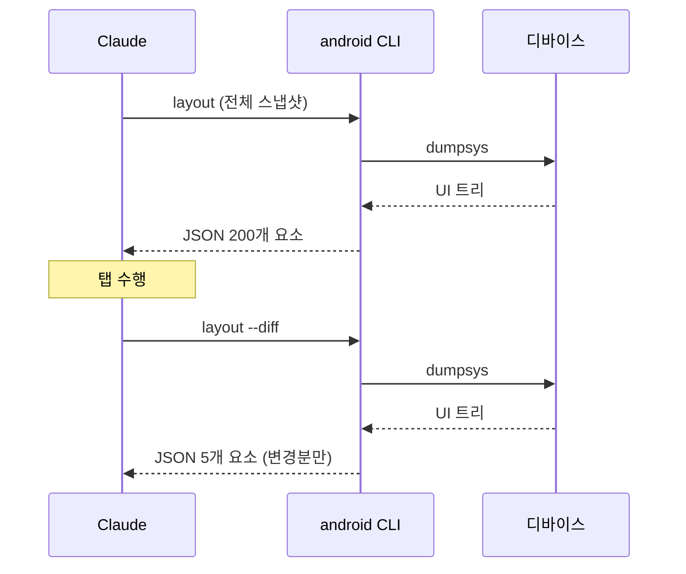
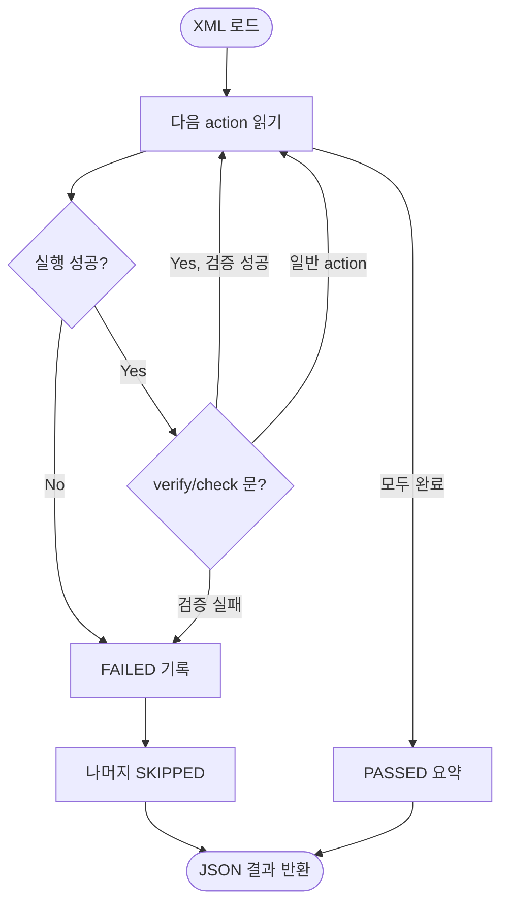

> 이 문서는 Google의 `android` CLI 도구(v0.7.x) 의 구조와 동작을 정리한 기술 레퍼런스다.

**기준 버전**: `0.7.15222914` (`android --version` 으로 확인)

---
## References

- [Android CLI 개요](https://developer.android.com/tools/agents/android-cli)
- [Android Developers Blog - Android CLI and skills: Build Android apps 3x faster using any agent](https://android-developers.googleblog.com/2026/04/build-android-apps-3x-faster-using-any-agent.html)
- [YouTube : Android CLI and skills: Build Android apps using AI agents](https://www.youtube.com/watch?v=AhrXPjk22OE)

## 5분 안에 훑기


1. `android` CLI 는 **SDK·AVD·UI 관찰·문서 검색** 을 하나의 진입점으로 묶은 도구다. `sdkmanager`·`avdmanager`·`adb` 가 각자 하던 일을 통합한다.

2. 가장 특징적인 기능은 `android layout` 이다. 화면을 **JSON 트리**로 반환해 AI 에이전트가 해석할 수 있게 한다.

3. 입력(탭·스와이프·텍스트) 은 여전히 `adb shell input` 이 담당한다. CLI 는 **관찰·지시**, ADB 는 **입력** 으로 역할이 나뉜다.

4. Journey 는 자연어 XML 로 E2E 테스트를 쓰는 방식이며, Espresso 를 **대체하지 않는 보완재** 다.


---


## 목적별 찾아가기


| 상황 | 읽어야 할 섹션 |
|------|---------------|
| 🔧 **설치·업데이트·환경 확인** | [§2 설치와 업데이트](#2-설치와-업데이트) |
| 📋 **어떤 커맨드가 있는지 전체 조망** | [§3 커맨드 한눈에 보기](#3-커맨드-한눈에-보기) · [§15 치트시트](#15-빠른-레퍼런스-치트시트) |
| 📦 **SDK 패키지 설치·업그레이드** | [§4 SDK 관리](#4-sdk-관리-sdk) |
| 🏗️ **새 프로젝트 만들기·기존 프로젝트 메타 조회** | [§5 프로젝트 생성과 분석](#5-프로젝트-생성과-분석-create-describe) |
| 👁️ **화면 상태를 JSON 으로 읽기** | [§6 런타임 UI 관찰](#6-런타임-ui-관찰-layout) |
| 📸 **스크린샷 캡처·라벨 번호로 좌표 찾기** | [§7 스크린샷과 시각 분석](#7-스크린샷과-시각-분석-screen) |
| 👆 **탭·스와이프·텍스트 입력 규칙** | [§8 상호작용: ADB 와의 역할 분리](#8-상호작용-adb-와의-역할-분리) |
| ▶️ **APK 설치·실행·디버그** | [§9 APK 배포와 실행](#9-apk-배포와-실행-run) |
| 🖥️ **에뮬레이터 생성·기동** | [§10 에뮬레이터](#10-에뮬레이터-emulator) |
| 📖 **Android 공식 문서 검색** | [§11 공식 문서 검색](#11-공식-문서-검색-docs) |
| 🧪 **자연어 기반 E2E 테스트 작성** | [§12 Journey](#12-journey--xml-기반-e2e-테스트) |
| 🧩 **Antigravity 스킬 관리** | [§13 Skills](#13-skills-android-skills) |
| ⚠️ **함정·제약 확인** | [§14 한계와 주의사항](#14-한계와-주의사항) |

## 커맨드 역색인


알파벳 순. 커맨드별 상세 설명이 어느 섹션에 있는지 찾을 때 쓴다.


| 커맨드 | 한 줄 기능 | 섹션 |
|--------|----------|:---:|
| `create` | 프로젝트 템플릿 생성 | [§5](#5-프로젝트-생성과-분석-create-describe) |
| `describe` | 빌드된 프로젝트 메타 JSON | [§5](#5-프로젝트-생성과-분석-create-describe) |
| `docs search` / `docs fetch` | Android Knowledge Base 조회 | [§11](#11-공식-문서-검색-docs) |
| `emulator create/start/stop/list/remove` | AVD 생명주기 | [§10](#10-에뮬레이터-emulator) |
| `info` | SDK 경로·버전 확인 | [§2](#2-설치와-업데이트) |
| `init` | 설치 직후 1회 초기화 | [§2](#2-설치와-업데이트) |
| `layout` / `layout --diff` | UI 트리 JSON 덤프 | [§6](#6-런타임-ui-관찰-layout) |
| `run --apks` | APK 설치·기동 | [§9](#9-apk-배포와-실행-run) |
| `screen capture` / `capture --annotate` / `resolve` | 스크린샷·번호 기반 좌표 변환 | [§7](#7-스크린샷과-시각-분석-screen) |
| `sdk install/update/remove/list` | SDK 패키지 관리 | [§4](#4-sdk-관리-sdk) |
| `skills add/remove/list/find` | Antigravity 스킬 레지스트리 | [§13](#13-skills-android-skills) |
| `update` | CLI 자체 업데이트 | [§2](#2-설치와-업데이트) |

> 최신 플래그 목록은 항상 `android <cmd> --help` 로 확인한다. 0.x 시리즈 특성상 시그니처가 조용히 바뀔 수 있다.

<!--more-->


---


## 1. 개요


`android` CLI 는 Google Antigravity 계열 에이전트 도구 생태계에 속한 커맨드라인 도구다. 한 줄로 요약하면 **"Android 기기·SDK·UI를 AI 에이전트가 다루기 쉬운 형태로 추상화한 단일 진입점"** 이다.


기존 `sdkmanager`, `avdmanager`, `adb`, Gradle 이 각자 하던 일을 하나의 `android <command>` 명령으로 묶고, **UI 를 JSON 으로 반환**해 LLM 친화적 상호작용을 가능하게 만든 것이 가장 큰 특징이다.


### 이 도구가 필요한 이유


전통적인 Android 개발 자동화는 ADB 를 얇게 감싼 셸 스크립트로 짜는 경우가 많다. 하지만 스크립트는 다음 두 지점에서 취약하다.


1. **화면을 해석할 수 없다** — 스크린샷을 찍어도 픽셀 좌표만 얻고, 그 안에 무엇이 있는지 스크립트가 알 수 없다.

2. **환경 준비가 흩어져 있다** — SDK 설치, AVD 생성, 패키지 설치가 각기 다른 도구를 요구한다.


`android` CLI 는 이 두 가지를 **`layout` + 통합된 서브커맨드**로 해결한다.


### 언제 쓰면 좋은가 / 쓰지 말아야 하는가


| 적합 | 비적합 |
|------|-------|
| 자동화 스크립트에서 UI 상태를 읽고 판단해야 할 때 | Android Studio 에서 손으로 하는 탐색적 디버깅 |
| 에뮬레이터·SDK를 코드로 재현 가능하게 관리할 때 | CI 에서 Espresso/Compose UI Test 수준의 정밀 테스트가 필요할 때 |
| 기획 문서의 자연어 시나리오를 그대로 테스트로 바꾸고 싶을 때 | 네트워크 트래픽 모니터링, 프로파일링 등 low-level 관찰 |

---


## 2. 설치와 업데이트


```bash

# 버전 확인

$ android --version

0.7.15222914


# 환경 정보

$ android info

sdk: /Users/user/Library/Android/sdk

version: 0.7.15222914

launcher_version: 0.7.15222914


# CLI 자체 업데이트

$ android update

```


`launcher_version` 이 `version` 과 분리되어 있는 점은 진입점(launcher) 과 실행 엔진을 별도로 갱신할 여지를 남겨둔 설계로 보인다. 현 시점에서는 두 값이 동일하다.


### android init

`android init` 은 에이전트 스킬 디렉토리 초기화 등 환경 셋업 명령이며, 설치 직후 1회 실행한다.
claude code, codex, gemini-cli, cursor, copilot, antigravity 와 같은 coding agent에 `android-cli skill`이 설치된다.


---


## 3. 커맨드 한눈에 보기


11개의 최상위 커맨드가 있다. 카테고리별로 정리하면 다음과 같다.


```mermaid

mindmap

root((android))

환경

init

info

update

sdk

skills

프로젝트

create

describe

디바이스

emulator

screen

런타임 관찰

layout

실행

run

지식

docs

```


| 카테고리 | 커맨드 | 주요 플래그 | 예시 한 줄 |
|---------|-------|------------|-----------|
| 환경 구성 | `sdk` | `install`, `update`, `remove`, `list` | `android sdk install "platforms;android-34"` |
| 환경 구성 | `skills` | `add`, `remove`, `list`, `find` | `android skills list` |
| 환경 구성 | `update`, `init`, `info` | — | `android info sdk` |
| 프로젝트 | `create` | `--name`, `--minSdk`, `-o`, `--list` | `android create empty-activity --name="My App"` |
| 프로젝트 | `describe` | `--project_dir` | `android describe --project_dir=./my-app` |
| 디바이스 | `emulator` | `create`, `start`, `stop`, `list`, `remove` | `android emulator start Pixel_8a` |
| 디바이스 | `screen` | `capture`, `resolve` | `android screen capture -o ./shot.png` |
| 관찰 | `layout` | `--diff`, `--pretty`, `--device`, `-o` | `android layout --pretty` |
| 실행 | `run` | `--apks`, `--activity`, `--debug`, `--device` | `android run --apks app-debug.apk` |
| 지식 | `docs` | `search`, `fetch` | `android docs search "compose state"` |

---


## 4. SDK 관리 (`sdk`)


기존 `sdkmanager` 위에 얹힌 래퍼다. 내부적으로 동일한 SDK 저장소를 사용하지만, 단일 진입점으로 통합된 점이 가치다.


```bash

# 설치된 + 사용 가능한 모든 패키지 나열

$ android sdk list --all


# 일부 실제 출력

build-tools/36.0.0 36.0.0 Android SDK Build-Tools 36

emulator 35.4.8 -> 36.5.10 Android Emulator

platform-tools 35.0.2 -> 37.0.0 Android SDK Platform-Tools

platforms/android-36 2.0.0 Android SDK Platform 36

ndk/28.2.13676358 28.2.13676358 NDK (Side by side)

system-images/android-36/... 6.0.0 -> 7.0.0 Google Play ARM 64 v8a System Image

```


`->` 표시는 업데이트 가능 버전을 의미한다. `android sdk update` 로 일괄 갱신하거나 `android sdk update <pkg>` 로 특정 패키지만 올릴 수 있다.


> 💡 CI 에서 특정 API 레벨이 필요할 때 `android sdk install "platforms;android-34"` 한 줄로 재현 가능. 기존 `sdkmanager --install` 보다 인자 형식이 일관된다.


---


## 5. 프로젝트 생성과 분석 (`create`, `describe`)


### `create`


```bash

$ android create --list

Template name Template description Tags

empty-activity (default) Empty Activity compose,activity,agp-9

```


v0.7 기준 **템플릿은 단 1개**(`empty-activity`) 다. AGP 9 + Compose 전제의 "깨끗한 시작점"을 제공한다. 아직 템플릿 생태계는 초기 단계이며, 팀 내부 보일러플레이트로는 부족하다.


```bash

$ android create empty-activity --name="My App" --minSdk=24 -o ./my-app

```


### `describe`


빌드된 프로젝트에서 **메타데이터 JSON 경로**를 반환한다. 다른 도구가 APK 위치 등을 탐색할 때 쓰인다.


```bash

$ android describe --project_dir=./my-app

```


flavor × buildType 매트릭스가 복잡한 프로젝트에서는 `describe` 출력을 파싱해 "Kids origin rc" 같은 특정 조합의 APK 경로를 찾는 워크플로우에 활용할 수 있다.


---


## 6. 런타임 UI 관찰 (`layout`)


CLI 의 가장 특징적인 기능이다. 화면에 보이는 UI 트리를 **JSON 배열**로 반환한다.


### 반환 스키마


| 필드 | 의미 |
|------|------|
| `text` | 요소가 포함한 리터럴 텍스트 |
| `resource-id` | Android 리소스 ID (개발자가 식별에 사용) |
| `content-desc` | 접근성용 설명. 아이콘 버튼도 여기에 의미가 담긴다 |
| `interactions` | `clickable`, `focusable`, `scrollable`, `long-clickable`, `password`, `checkable` |
| `state` | `checked`, `focused`, `selected` |
| `bounds` | 화면 좌표 `[minX,minY][maxX,maxY]` |
| `center` | 중심 좌표 `[x,y]` — 탭 입력에 바로 씀 |
| `off-screen` | UI 트리에 있지만 보이지 않는 요소 (스크롤 필요) |

### 실 출력 예시


```json
  {
    "interactions": [
      "clickable",
      "focusable",
      "long-clickable"
    ],
    "center": "[885,907]",
    "key": 3506402
  },
  {
    "content-desc": "메이플 키우기\n롤플레잉\n방치형 RPG\n몰입형\n별표 평점: 4.3\n",
    "center": "[525,1295]",
    "key": 3506402
  },
  {
    "content-desc": "WOS: 화이트아웃 서바이벌\n전략\n4X\n싱글 플레이어\n툰드라\n별표 평점: 4.1\n",
    "center": "[525,1532]",
    "key": 3506402
  },
  {
    "content-desc": "스톤에이지 키우기 - 모든 펫 증정!\n신규\n롤플레잉\n몰입형\n별표 평점: 4.4\n",
    "center": "[525,1770]",
    "key": 3506402
  },
  {
    "text": "4월: 하루를 디자인하세요",
    "center": "[283,890]",
    "key": 3506402
  },

```

**실제 스크린샷**


### `--diff` 로 컨텍스트 절약


긴 세션에서는 매번 전체 트리를 받으면 토큰이 빠르게 고갈된다. `--diff` 는 직전 호출 이후 **변경된 요소만** 반환한다.





계산기에 숫자를 입력할 때 "숫자 표시부"만 바뀐다. `--diff` 는 딱 그 요소 하나만 반환하므로 반복 입력이 많은 시나리오에 특히 잘 맞는다.


### 한계


`layout` 은 다음 상황에서 **빈 트리**를 반환하거나 실패한다.


- `WebView` 로 렌더링되는 콘텐츠 (인앱브라우저, 일부 배너)

- 애니메이션이 진행 중인 프레임

- 게임 엔진·Canvas 기반 네이티브 렌더링


이럴 때는 § 7 의 스크린샷 경로로 폴백한다.


---


## 7. 스크린샷과 시각 분석 (`screen`)


```bash

# 기본 캡처

$ android screen capture -o ./shot.png


# 번호가 붙은 어노테이트 스크린샷

$ android screen capture --annotate -o ./shot.png


# 라벨 → 좌표 역변환

$ android screen resolve --screen ./shot.png --string "#3"

540 1200

```


  

**annotate → resolve → adb** 파이프라인이 핵심이다. 예를 들어:


```bash

adb shell input $(android screen resolve --screen shot.png --string "tap #34")

```


이 한 줄은 "어노테이트된 34번 요소를 탭" 을 의미한다. 좌표 하드코딩 없이 **시각적 위치로 요소를 지시**할 수 있어, `layout` 이 실패하는 WebView 케이스에서도 상호작용이 가능하다.


| 수단 | 언제 쓰나 | 비용 |
|------|---------|-----|
| `layout --diff` | 일반적 UI 상호작용 (1순위) | 낮음 (JSON 소량) |
| `layout` | 첫 진입 또는 컨텍스트 리셋 후 | 중간 |
| `screen capture` | 이미지 해석이 필요한 경우 | 높음 (VLM 토큰) |
| `screen capture --annotate` + `resolve` | WebView·애니메이션 등 `layout` 실패 시 | 높음 |

---


## 8. 상호작용: ADB 와의 역할 분리


`android` CLI 는 **관찰과 지시**에 집중하고, 실제 입력 이벤트는 ADB 에 위임한다.


| 책임 | 도구 |
|------|------|
| SDK/AVD 관리 | `android sdk`, `android emulator` |
| 화면 관찰 | `android layout`, `android screen` |
| 좌표 변환 | `android screen resolve` |
| 입력 이벤트 | `adb shell input` |
| 로그·쉘 실행 | `adb logcat`, `adb shell` |

### 탭 한 번의 흐름


```bash

# 1. 무엇이 있는지 본다

android layout --pretty > ui.json


# 2. ui.json 에서 center 좌표를 뽑는다 (예: [405, 2196])


# 3. 탭한다

adb shell input tap 405 2196


# 4. 달라진 것만 본다

android layout --diff

```


### 꼭 지킬 규칙 3가지


1. 텍스트 입력 전에는 대상이 `"state": ["focused"]` 인지 먼저 확인한다.

2. 스크롤은 천천히. `adb shell input swipe x1 y1 x2 y2 500` 의 마지막 `500` 이 밀리초 단위 duration 이다. 작으면 투척(fling) 으로 해석되어 의도보다 멀리 스크롤된다.

3. 화면이 바뀐 뒤 2~3초 대기 후 `layout --diff` 로 비동기 콘텐츠 로딩을 흡수한다.


---


## 9. APK 배포와 실행 (`run`)


```bash

# 단일 APK

$ android run --apks ./app-debug.apk


# split APK (App Bundle 산출물)

$ android run --apks app.apk,app-armeabi-v7a.apk,app-xxxhdpi.apk


# 특정 액티비티 직접 기동

$ android run --apks app.apk --activity com.example.MainActivity


# 디버거 붙은 상태로 실행

$ android run --apks app.apk --debug --device R3CX50BSEVF

```


`--apks` 는 쉼표로 여러 개를 받아 **split APK 를 한 번에 설치**할 수 있다. Bundle 기반 빌드의 `universal.apk` 대신 실제 분할 APK 조합을 그대로 테스트하고 싶을 때 유용하다.


`--debug` 는 `ActivityManager` 에 debug flag 를 전달하며, Android Studio 의 Attach Debugger 와 결합해 쓰기 좋다.


---


## 10. 에뮬레이터 (`emulator`)


```bash

# 생성 가능한 프로필 조회

$ android emulator create --list-profiles


# 특정 프로필로 AVD 생성

$ android emulator create --profile=phone


# 기존 AVD 목록

$ android emulator list

Pixel_9_Pro_Fold_API_35

Pixel_8a

Pixel_7a

Pixel_6_API_26

Pixel_9_Pro_XL_API_35


# 기동·정지·삭제

$ android emulator start Pixel_8a

$ android emulator stop Pixel_8a

$ android emulator remove Pixel_7a

```


프로필은 `phone`, `watch`, `XR` 등 폼팩터 단위로 제공된다. CI headless 환경에서 여러 API 레벨 × 디바이스 조합을 생성해 동일 시나리오를 반복 실행하는 용도에 적합하다.


---


## 11. 공식 문서 검색 (`docs`)


```bash

$ android docs search "jetpack compose state"

1. State in Jetpack Compose

URL: kb://android/develop/ui/compose/state

2. State Hoisting in Jetpack Compose

URL: kb://android/develop/ui/compose/state-hoisting

3. State in Compose

URL: kb://android/develop/ui/compose/quick-guides/content/video/state-in-compose

...

```


Android Knowledge Base (`kb://` 스킴) 를 직접 조회한다. `android docs fetch <url>` 로 본문 전체를 받을 수 있다.


### Context7 MCP 와의 차이


| 도구 | 범위 | 장점 |
|------|------|------|
| `android docs` | Android 공식 개발자 문서 전용 | 최신성·정확성, 공식 표현 일치 |
| Context7 MCP | 일반 오픈소스 라이브러리 | 대상 폭이 넓음, 버전별 조회 |
| WebSearch | 그 외 전부 | 폭넓음, 출처 다양 |

Android API 마이그레이션 가이드·공식 베스트 프랙티스가 필요하면 **`android docs` 를 먼저** 찾는다. 그 다음 구체적 라이브러리(예: Orbit-MVI) 문서가 필요하면 Context7, 블로그·이슈 검색이 필요하면 WebSearch 순으로 내려간다.


---


## 12. Journey — XML 기반 E2E 테스트


Journey 는 **자연어 `<action>` 순서를 담은 XML** 을 테스트 스펙으로 사용하는 방식이다.


```xml

<journey name="Open News Tab">

<description>홈에서 새소식 탭으로 이동하는 기본 플로우</description>

<actions>

<action>Tap the "새소식" bottom navigation item</action>

<action>Verify that the news list is displayed</action>

<action>Check that the top-most news item is clickable</action>

</actions>

</journey>

```


Claude 가 각 `<action>` 을 순차 해석해 `layout`/`screen`/`adb` 조합으로 실행하고, PASS/FAIL/SKIPPED JSON 을 반환한다.


### 실행 흐름





### 다른 테스트 도구와의 포지셔닝


| 도구 | 작성 방식 | 실행 주체 | 강점 | 약점 |
|------|---------|---------|------|------|
| Espresso / Compose UI Test | Kotlin 코드 | JVM | 속도·정확성·CI 안정성 | 작성 비용 높음 |
| Maestro | YAML DSL | Maestro runtime | 간결한 DSL, 기기 호환성 | 별도 러너 필요 |
| UI Automator | Java/Kotlin | 기기 내 | 시스템 UI 접근 | 러닝 커브 |
| **Journey** | **자연어 XML** | **LLM** | **기획 문서 → 테스트 직결** | **LLM 비결정성, 과금** |

Journey 는 Espresso 를 **대체하지 않는다**. "사람이 말로 설명한 시나리오를 그대로 돌리는" 용도의 보완재로 보는 것이 맞다.


---


## 13. Skills (`android skills`)


Antigravity 에이전트 생태계의 스킬 레지스트리에 연결된다. 설치된 스킬을 조회·추가·제거할 수 있다.


```bash

$ android skills list

android-cli

navigation-3

edge-to-edge

play-billing-library-version-upgrade

r8-analyzer

migrate-xml-views-to-jetpack-compose

agp-9-upgrade

```


각 스킬은 **특정 Android 주제에 대한 단계별 가이드**를 담고 있다. 예를 들어 `navigation-3` 스킬은 Navigation 3 라이브러리 도입을, `migrate-xml-views-to-jetpack-compose` 는 XML View → Compose 마이그레이션을 안내한다.


### `android skills` vs `.claude/skills` 구분


| 구분 | `android skills` | Claude Code `.claude/skills` |
|------|-----------------|-----------------------------|
| 관리 대상 | Antigravity 에이전트 전용 스킬 | Claude Code 세션 스킬 (`/brainstorming` 등) |
| 저장 위치 | `~/.claude/skills/<name>` 하위 | `~/.claude/plugins/.../skills/` 또는 로컬 |
| 업데이트 | `android skills add/remove` | 플러그인·마켓플레이스 별 |
| 네임스페이스 | CLI 도구 고유 | Claude Code 고유 |

같은 디렉토리를 공유하는 경우도 있지만(`android-cli` 자체가 양쪽에 있다), **같은 이름이어도 역할이 다를 수 있다**는 점만 기억하면 된다.


---


## 14. 한계와 주의사항


**버전 관련**

- 0.x 시리즈이므로 커맨드 시그니처가 변경될 가능성이 있다. 문서·스크립트에 쓰기 전 `android <cmd> --help` 로 최신 옵션을 확인한다.

- 템플릿이 1개(`empty-activity`) 뿐이라 팀 표준 보일러플레이트로는 부족하다.


**관찰 관련**

- `layout` 은 WebView·애니메이션 프레임에서 실패한다. 이 경우 `screen capture --annotate` 로 폴백한다.

- `content-desc` 가 비어 있는 요소는 접근성 개선의 대상이자 `layout` 기반 자동화가 어려운 지점이다.


**실행 관련**

- `run --apks` 는 signing·flavor 구분을 알아서 처리하지 않는다. Gradle 빌드 결과 경로를 호출자가 직접 넘겨야 한다.

- `--debug` 는 Android Studio 디버거 연결을 상정한다. headless CI 에서는 기대대로 동작하지 않을 수 있다.


**플랫폼**

- 현재 확인된 환경은 macOS. Linux/Windows 호환성은 별도 검증이 필요하다.


---


## 15. 빠른 레퍼런스 (치트시트)


### 관찰


```bash

android layout --pretty # 전체 UI 트리

android layout --diff # 변경분만

android layout -o ui.json # 파일로 저장

android screen capture -o shot.png # 스크린샷

android screen capture --annotate -o a.png # 번호 달린 스크린샷

android screen resolve --screen a.png --string "#3" # 번호 → 좌표

```


### 실행


```bash

android run --apks app-debug.apk

android run --apks app.apk,app-x86.apk # split APK

android run --apks app.apk --debug

android run --apks app.apk --activity com.x.Main

android run --apks app.apk --device R3CX50BSEVF

```


### 디바이스


```bash

android emulator list

android emulator create --profile=phone

android emulator start Pixel_8a

android emulator stop Pixel_8a

```


### SDK


```bash

android sdk list --all

android sdk install "platforms;android-34"

android sdk update

android sdk remove "build-tools;29.0.0"

```


### 지식


```bash

android docs search "keyword"

android docs fetch "kb://android/..."

```


### 메타


```bash

android --version

android info

android info sdk

android update

android skills list

android <cmd> --help

```


